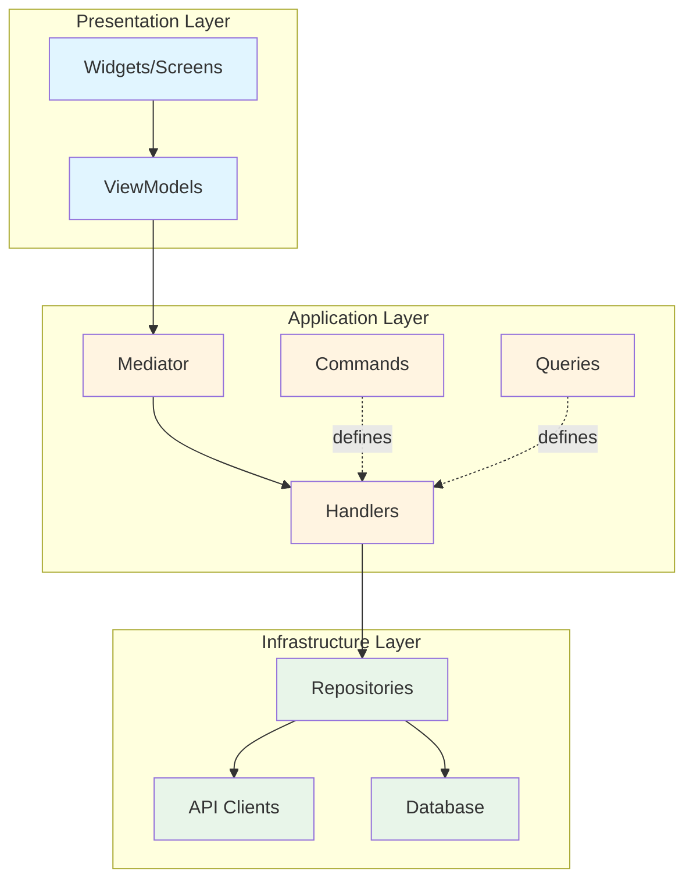
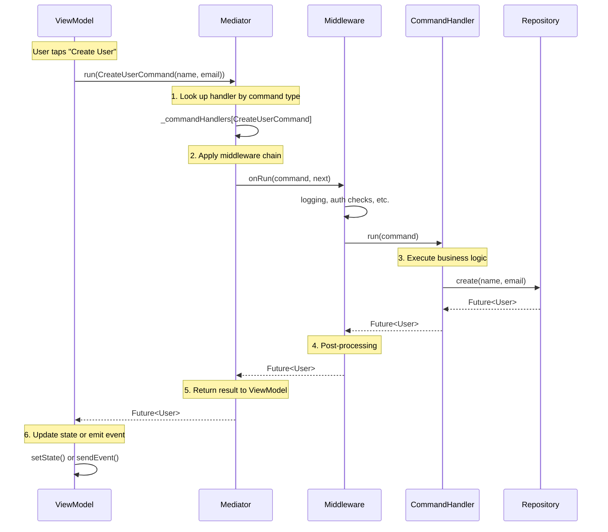

# Core Architecture

Chassis implements a layered architecture grounded in established software engineering principles. Understanding these principles helps you make informed architectural decisions as your application grows. This guide explores three foundational concepts that underpin the framework: Layered Architecture, Command-Query Separation, and the Mediator Pattern. These patterns are not unique to Chassis; they are proven solutions to common software design challenges that have been refined over decades of industry practice.

## Layered Architecture

### The Three Layers

Chassis organizes code into three distinct layers, each with clearly defined responsibilities. The Presentation Layer contains your widgets and ViewModels, managing everything the user sees and interacts with. The Application Layer houses your business logic through Commands, Queries, and Handlers, remaining completely independent of UI concerns. The Infrastructure Layer manages external dependencies like databases, APIs, and file systems through Repository interfaces.

Dependencies flow inward following the Dependency Rule. The Infrastructure layer depends on nothing except external systems. The Application layer depends only on Repository interfaces, never concrete implementations. The Presentation layer depends on the Application layer exclusively through the Mediator. This inversion of control enables testing and flexibility, as you can substitute implementations without modifying consumers.



In your project structure, this translates to organized directories:

```
lib/
  ├── presentation/        # ViewModels, Widgets
  ├── application/         # Commands, Queries, Handlers
  └── infrastructure/      # Repositories, Data Sources
```

### The Dependency Rule

The Dependency Rule states that source code dependencies must point inward, toward higher-level policies. In concrete terms, Handlers depend on Repository interfaces rather than implementations. ViewModels depend on the Mediator, not Handlers directly. Widgets depend on ViewModels, not domain logic. This inversion of control enables testing, as you can substitute implementations without modifying consumers.

Consider how this works in practice. A Handler that creates users depends on an `IUserRepository` interface:

```dart
// ✅ Correct: Handler depends on abstraction
class CreateUserHandler implements CommandHandler<CreateUserCommand, User> {
  final IUserRepository _repository;  // Interface dependency

  CreateUserHandler(this._repository);

  @override
  Future<User> run(CreateUserCommand command) async {
    return await _repository.create(command.name, command.email);
  }
}

// ❌ Incorrect: Handler depends on concrete implementation
class CreateUserHandler {
  final FirestoreUserRepository _repository;  // Tight coupling
  // This prevents testing with mocks and locks you into Firestore
}
```

The interface abstraction allows you to test the Handler by providing a mock repository. No UI framework required, no database connection needed—just pure logic verification. This is the testability benefit of proper layering.

### Benefits of Layering

Each layer can be tested independently. Application logic tests run without a Flutter environment or database connection, executing in milliseconds rather than seconds. You can swap a REST API repository for a GraphQL implementation without touching handlers or ViewModels, as both satisfy the same interface contract. Changes propagate predictably—a UI redesign affects only the Presentation layer, while a database migration impacts only the Infrastructure layer.

The ViewModel is architecturally restricted to being a transformation layer for the UI. It cannot accidentally implement business logic because it lacks direct access to repositories. It must delegate to a Handler via the Mediator, which creates a natural checkpoint where logic belongs in tested, reusable components. This prevention of logic leaks maintains the integrity of your architecture over time, even as teams grow and developers rotate.

For concrete testing examples demonstrating how to test each layer in isolation, see [Business Logic](02_business_logic.md#testing-strategy).

## Command-Query Separation

### The Principle

Command-Query Separation, formalized by Bertrand Meyer, states that methods should either change state or return data, never both. In Chassis, this principle manifests through distinct message types. Commands represent intent to mutate state and may return result values like a created entity ID. Queries retrieve data without side effects and can be executed multiple times safely.

This separation improves reasoning about side effects. When you see a Query in code, you know it's safe to call multiple times without unintended consequences. When you see a Command, you understand that state will change and execution should be deliberate. The type system enforces this distinction at compile time.

```dart
// Command: Mutates state, may return a result
class UpdateUserEmailCommand implements Command<void> {
  const UpdateUserEmailCommand({required this.userId, required this.newEmail});

  final String userId;
  final String newEmail;
}

// Query (Read): Fetches data without mutation
class GetUserQuery implements ReadQuery<User> {
  const GetUserQuery({required this.userId});

  final String userId;
}

// Query (Watch): Streams data without mutation
class WatchUserQuery implements WatchQuery<User> {
  const WatchUserQuery({required this.userId});

  final String userId;
}
```

These message classes are defined in [lib/src/mediator/command.dart:19-22](../lib/src/mediator/command.dart#L19-L22) and [lib/src/mediator/query.dart:7-39](../lib/src/mediator/query.dart#L7-L39).

### ReadQuery vs WatchQuery

Chassis extends Command-Query Separation by distinguishing one-time reads from reactive streams. ReadQuery serves situations where you need the current state once, such as fetching a user profile when a screen loads. WatchQuery handles scenarios requiring ongoing reactivity, like displaying real-time message counts or monitoring collaborative document changes.

This distinction enables the Mediator to route requests to the appropriate handler type. Attempting to watch a ReadQuery results in a compile error, preventing accidental stream subscriptions for one-time operations. Conversely, using read with a WatchQuery retrieves only the current value without establishing an ongoing subscription.

```dart
// One-time fetch
final user = await mediator.read(GetUserQuery(userId: '123'));

// Continuous stream
mediator.watch(WatchUserQuery(userId: '123')).listen((user) {
  print('User updated: ${user.name}');
});
```

The implementation details can be found in [lib/src/mediator/mediator.dart:136-189](../lib/src/mediator/mediator.dart#L136-L189).

### Practical Implications

Command-Query Separation enables performance optimizations. Read operations can be cached aggressively because they do not mutate state, allowing you to serve subsequent requests from memory. It also clarifies API design—a method returning `Future<User>` should never have side effects, making the code's behavior predictable.

In distributed systems, this separation maps naturally to CQRS (Command Query Responsibility Segregation) architectures. You can scale read and write paths independently, optimizing each for their specific access patterns. A single CommandHandler, such as LogoutHandler, can be triggered from multiple ViewModels—Profile, Settings, or ExpiredSessionMiddleware—without code duplication. The logic lives in one place and is reused by reference to the Command type.

## The Mediator Pattern

### Pattern Overview

The Mediator pattern decouples objects by introducing an intermediary that handles their interactions. In Chassis, the Mediator sits between ViewModels and Handlers, managing the routing of messages. Instead of ViewModels calling Handlers directly, they dispatch messages through the Mediator, which looks up and invokes the appropriate Handler.

This decoupling provides several benefits. ViewModels depend only on message types, not handler implementations, which reduces coupling across your codebase. The Mediator maintains a catalog of handlers, enabling runtime introspection of application capabilities. You can swap handler implementations without modifying ViewModels, as the Mediator handles the routing indirection.

Compare the traditional approach with the Mediator approach:

```dart
// Without Mediator (tight coupling)
class UserViewModel {
  final CreateUserHandler _createHandler;
  final GetUserHandler _getHandler;

  UserViewModel(this._createHandler, this._getHandler); // Many dependencies

  void createUser(String name, String email) {
    _createHandler.run(CreateUserCommand(name: name, email: email));
  }
}

// With Mediator (loose coupling)
class UserViewModel extends ViewModel<UserState, UserEvent> {
  UserViewModel(Mediator mediator) : super(mediator, initial: UserState.initial());

  void createUser(String name, String email) {
    run(CreateUserCommand(name: name, email: email), (_) {});
  }
}
```

### Message Flow

When a ViewModel calls `mediator.run(command)`, several steps occur behind the scenes. The Mediator performs type-based lookup in its handler registry to find the appropriate CommandHandler. Middleware executes in the order registered, forming a processing pipeline for cross-cutting concerns like logging or authentication. The matched Handler receives the command and executes its business logic, coordinating with repositories as needed. Finally, the result flows back through the middleware chain to the ViewModel.



Handler registration happens at application startup, creating a type-safe registry. The lookup is efficient, using Dart's type system to match messages with handlers. This implementation can be examined in [lib/src/mediator/mediator.dart:200-216](../lib/src/mediator/mediator.dart#L200-L216).

### Type Safety and Discoverability

The Mediator registry provides compile-time type safety. Attempting to dispatch an unregistered command results in a runtime error that can be caught during development and testing. When using code generation, the type-safe extension methods provide even stronger guarantees, turning missing handlers into compile-time errors.

A significant advantage of this pattern is discoverability. Your application's capabilities become self-documenting through Command and Query classes. To understand what a feature can do, examine its message types. This differs fundamentally from traditional architectures where capabilities are scattered across controller methods with no central catalog.

```dart
// Application capabilities are discoverable
class UserFeature {
  // Commands (writes)
  final createUser = CreateUserCommand(...);
  final updateUser = UpdateUserCommand(...);
  final deleteUser = DeleteUserCommand(...);

  // Queries (reads)
  final getUser = GetUserQuery(...);
  final watchUsers = WatchUsersQuery(...);
}

// IDE autocomplete shows all available operations
mediator.run(/* IDE suggests CreateUserCommand, UpdateUserCommand, etc. */);
```

A developer can look at the list of Command and Query classes to understand exactly what the application does, without diving into implementation details. This "code as documentation" quality improves maintainability as teams scale and new developers join projects.

### Middleware

Middleware intercepts messages before they reach handlers, enabling cross-cutting concerns to be implemented once rather than duplicated across handlers. Common use cases include logging, performance monitoring, authentication checks, and caching. Middleware executes in the order registered, forming a processing pipeline that every message flows through.

```dart
class LoggingMiddleware implements MediatorMiddleware {
  @override
  Future<T> onRun<T>(Command<T> command, NextRun<Command<T>, T> next) async {
    print('Executing command: ${command.runtimeType}');
    final stopwatch = Stopwatch()..start();

    final result = await next(command);

    stopwatch.stop();
    print('Command ${command.runtimeType} completed in ${stopwatch.elapsedMilliseconds}ms');
    return result;
  }

  @override
  Future<T> onRead<T>(ReadQuery<T> query, NextRead<ReadQuery<T>, T> next) async {
    print('Executing query: ${query.runtimeType}');
    return await next(query);
  }

  @override
  Stream<T> onWatch<T>(WatchQuery<T> query, NextWatch<WatchQuery<T>, T> next) {
    print('Watching query: ${query.runtimeType}');
    return next(query);
  }
}

// Register middleware
final mediator = Mediator();
mediator.addMiddleware(LoggingMiddleware());
```

The middleware implementation is defined in [lib/src/mediator/middleware.dart](../lib/src/mediator/middleware.dart).

## Summary

These three principles—Layered Architecture, Command-Query Separation, and the Mediator Pattern—combine to create a framework where architectural intent is enforced at the code level. The layering prevents logic leaks by restricting what each layer can access. Command-Query Separation makes side effects explicit and enables optimization opportunities. The Mediator decouples senders from receivers while maintaining type safety and discoverability.

While other state management solutions allow developers to place logic anywhere—in Widgets, Controllers, or Services arbitrarily—Chassis enforces a specific path: UI → ViewModel → Command → Mediator → Handler → Repository. This guardrail over guidelines approach ensures that a junior developer and a senior architect produce code with the same structural footprint, reducing code review friction and technical debt accumulation.

With this foundation, the subsequent sections explore implementation details: writing business logic manually in [Business Logic](02_business_logic.md), automating boilerplate with code generation in [Code Generation](03_code_generation.md), and integrating with Flutter's widget tree in [UI Integration](04_ui_integration.md).
