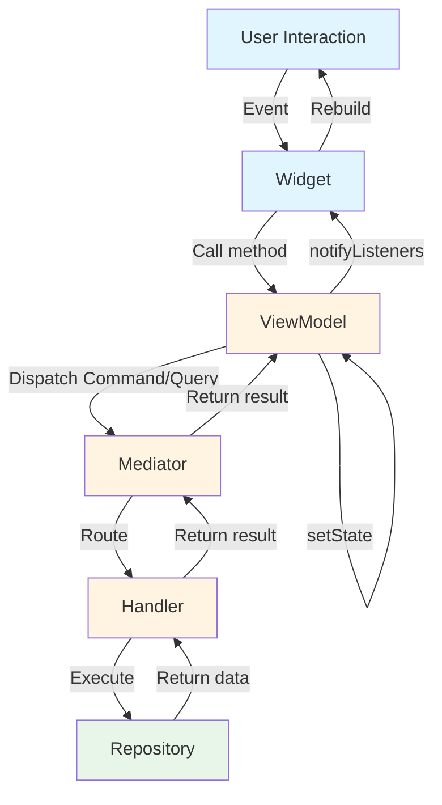

# UI Integration

This guide focuses on the Presentation layer—connecting business logic to Flutter widgets through ViewModels, reactive state management, and event handling. You'll learn how ViewModels transform domain data into UI-ready state, how AsyncBuilder renders asynchronous data without manual state checking, and how to handle one-time events like navigation or snackbars. By the end, you'll understand the unidirectional data flow pattern that makes UI complexity scale linearly with feature complexity rather than exponentially.

## The ViewModel Pattern

### Role and Responsibilities

In the Chassis architecture, ViewModels serve as the bridge between business logic and the widget tree, as explained in the layered architecture from [Core Architecture](01_core_architecture.md#layered-architecture). Their primary responsibility is state transformation—converting raw domain data into a format the UI can render directly without additional processing. Unlike traditional controllers that might manipulate widgets, ViewModels emit state changes and widgets rebuild reactively in response.

ViewModels manage three distinct concerns. First, they hold the current UI state and notify listeners when it changes through Flutter's ChangeNotifier mechanism. Second, they translate user actions into Commands or Queries and dispatch them through the Mediator. Third, they emit events for one-time occurrences like showing snackbars or navigating, keeping these separate from persistent state.

```dart
class UserProfileState {
  const UserProfileState({
    required this.user,
    required this.isEditing,
  });

  final Async<User> user;
  final bool isEditing;

  UserProfileState copyWith({
    Async<User>? user,
    bool? isEditing,
  }) {
    return UserProfileState(
      user: user ?? this.user,
      isEditing: isEditing ?? this.isEditing,
    );
  }

  static UserProfileState initial() {
    return UserProfileState(
      user: Async.loading(),
      isEditing: false,
    );
  }
}

sealed class UserProfileEvent {}

class UserUpdatedEvent implements UserProfileEvent {
  const UserUpdatedEvent();
}

class UserUpdateFailedEvent implements UserProfileEvent {
  const UserUpdateFailedEvent(this.message);
  final String message;
}

class UserProfileViewModel extends ViewModel<UserProfileState, UserProfileEvent> {
  UserProfileViewModel(Mediator mediator)
      : super(mediator, initial: UserProfileState.initial());

  void loadUser(String userId) {
    watch(WatchUserQuery(userId: userId), (asyncUser) {
      setState(state.copyWith(user: asyncUser));
    });
  }

  void updateEmail(String userId, String newEmail) {
    run(UpdateUserEmailCommand(userId: userId, newEmail: newEmail), (result) {
      switch (result) {
        case AsyncData():
          sendEvent(UserUpdatedEvent());
        case AsyncError(:final error):
          sendEvent(UserUpdateFailedEvent(error.toString()));
        default:
          break;
      }
    });
  }

  void toggleEditMode() {
    setState(state.copyWith(isEditing: !state.isEditing));
  }
}
```

State immutability ensures predictable behavior. The `copyWith` pattern creates new state objects rather than mutating existing ones, which simplifies debugging and prevents subtle bugs from shared mutable state. Local UI state like `isEditing` lives in the ViewModel, while domain data like user profiles flows through the Mediator from handlers.

### Unidirectional Data Flow

Chassis enforces unidirectional data flow where user interactions flow upward as Commands or Queries, and data flows downward as state updates. This pattern prevents bidirectional dependencies that complicate debugging and testing. Widgets never call repositories directly, and repositories never know about ViewModels, creating a clean separation of concerns.



This pattern creates a predictable loop: interaction → command → handler → repository → state update → widget rebuild. Data flows in one direction, making it easy to trace how user actions affect state and how state changes trigger UI updates. If the UI displays incorrect data, you can trace backward through this flow—check the state, check ViewModel updates, check handler logic, check repository implementation.

Unlike traditional controllers that might manipulate widgets directly, a Chassis ViewModel relies exclusively on state mutation. When a user taps a button, the ViewModel does not modify the view directly. Instead, it dispatches a command to the Mediator and updates its internal state based on the result. The widget observes this state change and rebuilds accordingly.

### Lifecycle Methods

ViewModels provide three methods for interacting with the Mediator, each serving distinct use cases. The `watch()` method subscribes to WatchQuery streams, establishing an ongoing connection that pushes updates as data changes. The `read()` method executes ReadQuery operations once, fetching current state without ongoing subscriptions. The `run()` method dispatches Commands, handling both the execution and the result.

```dart
class ExampleViewModel extends ViewModel<ExampleState, ExampleEvent> {
  // watch() - Reactive streams
  void watchUser(String userId) {
    watch(WatchUserQuery(userId: userId), (asyncUser) {
      setState(state.copyWith(user: asyncUser));
    });
  }

  // read() - One-time fetch
  void loadInitialData(String userId) {
    read(GetUserQuery(userId: userId), (asyncUser) {
      setState(state.copyWith(user: asyncUser));
    });
  }

  // run() - Command execution
  void deleteUser(String userId) {
    run(DeleteUserCommand(userId: userId), (result) {
      if (result case AsyncData()) {
        sendEvent(UserDeletedEvent());
      }
    });
  }
}
```

The `watch()` method subscribes to a WatchQuery stream, calling the provided callback whenever the stream emits a new value. Subscription management happens automatically—the ViewModel disposes subscriptions when it disposes, preventing memory leaks. Use watch for data that changes over time, like todo lists, presence indicators, or collaborative document state.

The `read()` method executes a ReadQuery once and calls the callback with the result wrapped in Async<T>. Use this for initial data loads or one-off fetches where you don't need ongoing updates. The callback receives the result whether it succeeds or fails, allowing you to update state appropriately in both cases.

The `run()` method dispatches a Command and handles the result, commonly used to trigger state mutations and emit events based on success or failure. The callback receives an Async<T> result, enabling pattern matching to handle different outcomes distinctly.

## Modeling State with Async<T>

### The Async<T> Type

Async<T> is a sealed class representing the complete lifecycle of an asynchronous operation, ensuring UI handles all possibilities—loading, success, and error. This eliminates bugs where loading states are forgotten or error conditions go unhandled. The sealed class guarantees exhaustive pattern matching, where Dart's type system requires handling all three cases.

```dart
sealed class Async<T> {
  const Async();

  T? get valueOrNull;
  Object? get errorOrNull;
  bool get isLoading;
  bool get hasValue;
  bool get hasError;

  // Factories
  const factory Async.data(T value) = AsyncData<T>;
  const factory Async.loading([T? previous]) = AsyncLoading<T>;
  const factory Async.error(Object error, {StackTrace? stackTrace, T? previous}) = AsyncError<T>;
}

class AsyncData<T> extends Async<T> {
  const AsyncData(this.value);
  final T value;
}

class AsyncLoading<T> extends Async<T> {
  const AsyncLoading([this.previous]);
  final T? previous;  // Optional previous data for anti-flickering
}

class AsyncError<T> extends Async<T> {
  const AsyncError(this.error, {this.stackTrace, this.previous});
  final Object error;
  final StackTrace? stackTrace;
  final T? previous;  // Optional previous data for soft errors
}
```

AsyncLoading and AsyncError can optionally retain previous data, enabling the UI to show stale data during refetches or display previous values alongside error messages. This anti-flickering capability improves user experience significantly, as discussed in the AsyncBuilder section.

### Pattern Matching

Dart 3's pattern matching makes working with Async<T> concise and type-safe. The sealed class ensures exhaustive checking—the compiler requires handling all three cases when switching on Async<T> values.

```dart
// In ViewModel
void loadUser(String userId) {
  read(GetUserQuery(userId: userId), (asyncUser) {
    switch (asyncUser) {
      case AsyncLoading():
        setState(state.copyWith(user: asyncUser));
      case AsyncData(:final value):
        setState(state.copyWith(user: asyncUser));
        sendEvent(UserLoadedEvent(value));
      case AsyncError(:final error):
        setState(state.copyWith(user: asyncUser));
        sendEvent(UserLoadFailedEvent(error.toString()));
    }
  });
}

// Or using if-case for specific scenarios
if (asyncUser case AsyncData(:final value)) {
  // Guaranteed non-null value in this scope
  print('User name: ${value.name}');
}
```

Pattern matching extracts values safely. The compiler guarantees that `value` is non-null within the `AsyncData` case, eliminating defensive null checks. This type safety prevents runtime errors and makes code more maintainable.

### Fluent State Transitions

Async<T> provides fluent methods for common state transitions, simplifying how ViewModels update state as operations progress through their lifecycle.

```dart
// Transition to loading while keeping current data (refetch)
final refetching = currentState.toLoading();  // AsyncLoading(previous: currentData)

// Transition to data (success)
final success = currentState.toData(newUser);  // AsyncData(newUser)

// Transition to error while keeping current data (soft error)
final softError = currentState.toError(exception, stackTrace);  // AsyncError(..., previous: currentData)
```

These methods preserve previous data when appropriate, enabling the UI to maintain display during refetches or show stale data with error overlays. This pattern supports the anti-flickering behavior that improves user experience during data refreshes.

## AsyncBuilder Widget

### Basic Usage

AsyncBuilder is a StatelessWidget that renders different UI based on Async<T> state, eliminating manual state checking in build methods. It takes an Async<T> state and three builders—one for data, one for loading, and one for errors—automatically selecting the appropriate builder based on current state.

```dart
class UserProfileScreen extends StatelessWidget {
  const UserProfileScreen({Key? key}) : super(key: key);

  @override
  Widget build(BuildContext context) {
    final viewModel = context.watch<UserProfileViewModel>();

    return Scaffold(
      appBar: AppBar(title: const Text('User Profile')),
      body: AsyncBuilder<User>(
        state: viewModel.state.user,
        builder: (context, user) {
          // Renders when data is available
          return Column(
            children: [
              CircleAvatar(
                backgroundImage: NetworkImage(user.avatarUrl),
                radius: 50,
              ),
              const SizedBox(height: 16),
              Text(user.name, style: Theme.of(context).textTheme.headlineMedium),
              Text(user.email),
              const SizedBox(height: 24),
              Text('Member since ${user.createdAt.year}'),
            ],
          );
        },
        loadingBuilder: (context) {
          // Renders during initial load
          return const Center(child: CircularProgressIndicator());
        },
        errorBuilder: (context, error) {
          // Renders on error with no previous data
          return Center(
            child: Column(
              mainAxisAlignment: MainAxisAlignment.center,
              children: [
                const Icon(Icons.error, size: 48, color: Colors.red),
                const SizedBox(height: 16),
                Text('Error loading profile: $error'),
                ElevatedButton(
                  onPressed: () => viewModel.loadUser('userId'),
                  child: const Text('Retry'),
                ),
              ],
            ),
          );
        },
      ),
    );
  }
}
```

The `builder` callback receives the unwrapped User object. No null checks are required—AsyncBuilder only calls this builder when data is available and successfully unwrapped. Custom `loadingBuilder` and `errorBuilder` provide branded loading and error experiences tailored to your application's design.

### Anti-Flickering with maintainState

The `maintainState` parameter, which defaults to `true`, prevents flickering during refetches by showing previous data during loading states instead of the loading widget. This creates a much smoother user experience, especially for pull-to-refresh scenarios.

```dart
AsyncBuilder<User>(
  state: viewModel.state.user,
  maintainState: true,  // Default behavior
  builder: (context, user) {
    // Shows previous user data during refetch
    return UserCard(user: user);
  },
  loadingBuilder: (context) {
    // Only shown on INITIAL load when no data exists
    return const CircularProgressIndicator();
  },
)
```

Consider the visual flow through different states. On initial load with `Async.loading()` and no previous data, the `loadingBuilder` renders showing a spinner. After first load with `Async.data(user)`, the `builder` renders displaying the user profile. On refetch with `Async.loading(previous: user)`, the `builder` continues rendering with previous user data—no flicker to loading state. When refetch completes with `Async.data(newUser)`, the `builder` renders with updated user data, smoothly transitioning from old to new.

This pattern is ideal for pull-to-refresh scenarios where showing stale data during refresh provides better UX than a loading spinner. Users see their data immediately and can continue interacting while fresh data loads in the background. When fresh data arrives, the UI updates smoothly without jarring transitions.

## Handling One-Time Events

### State vs Events

A fundamental architectural distinction in Chassis is between persistent state and ephemeral events. State represents data that determines what the UI renders at any moment—user profiles, form field values, lists of items, loading indicators. If the user rotates their device or navigates away and back, this state should persist and restore the same display.

Events represent one-time occurrences that should not be replayed if the UI rebuilds. They trigger side effects like navigation, snackbars, dialogs, or vibrations. A "User created successfully" event shows a snackbar once, not every time the widget rebuilds. A "Payment failed" event shows an error dialog once. A "Login succeeded" event navigates to the home screen once.

```dart
// State - Persistent
class CheckoutState {
  const CheckoutState({
    required this.cart,
    required this.shippingAddress,
    required this.isProcessingPayment,
  });

  final Async<List<CartItem>> cart;
  final Address? shippingAddress;
  final bool isProcessingPayment;
}

// Events - Ephemeral
sealed class CheckoutEvent {}

class PaymentSuccessEvent implements CheckoutEvent {
  const PaymentSuccessEvent(this.orderId);
  final String orderId;
}

class PaymentFailedEvent implements CheckoutEvent {
  const PaymentFailedEvent(this.reason);
  final String reason;
}

class NavigateToOrderConfirmationEvent implements CheckoutEvent {
  const NavigateToOrderConfirmationEvent(this.orderId);
  final String orderId;
}
```

State determines what appears on screen right now. Events describe what should happen once in response to an action. This separation prevents bugs where snackbars show repeatedly or navigation happens multiple times due to widget rebuilds.

### ConsumerMixin Usage

ConsumerMixin provides automatic event subscription management in StatefulWidgets, handling subscription lifecycle through `initState` and `dispose`. It ensures subscriptions are created when the widget initializes and cancelled when the widget disposes, preventing memory leaks.

```dart
class CheckoutScreen extends StatefulWidget {
  const CheckoutScreen({Key? key}) : super(key: key);

  @override
  State<CheckoutScreen> createState() => _CheckoutScreenState();
}

class _CheckoutScreenState extends State<CheckoutScreen> with ConsumerMixin {
  @override
  void initState() {
    super.initState();

    // Subscribe to events
    onEvent<CheckoutViewModel, CheckoutEvent>((event) {
      switch (event) {
        case PaymentSuccessEvent(:final orderId):
          ScaffoldMessenger.of(context).showSnackBar(
            SnackBar(content: Text('Payment successful! Order #$orderId')),
          );

        case PaymentFailedEvent(:final reason):
          showDialog(
            context: context,
            builder: (context) => AlertDialog(
              title: const Text('Payment Failed'),
              content: Text(reason),
              actions: [
                TextButton(
                  onPressed: () => Navigator.pop(context),
                  child: const Text('OK'),
                ),
              ],
            ),
          );

        case NavigateToOrderConfirmationEvent(:final orderId):
          Navigator.pushReplacement(
            context,
            MaterialPageRoute(
              builder: (context) => OrderConfirmationScreen(orderId: orderId),
            ),
          );
      }
    });
  }

  @override
  Widget build(BuildContext context) {
    final viewModel = context.watch<CheckoutViewModel>();

    return Scaffold(
      appBar: AppBar(title: const Text('Checkout')),
      body: Column(
        children: [
          AsyncBuilder<List<CartItem>>(
            state: viewModel.state.cart,
            builder: (context, items) => CartItemsList(items: items),
          ),
          ElevatedButton(
            onPressed: viewModel.processPayment,
            child: const Text('Complete Purchase'),
          ),
        ],
      ),
    );
  }
}
```

The `onEvent` method creates a subscription to the ViewModel's event stream, calling the provided callback each time an event is emitted. Subscriptions are stored internally and cancelled automatically when the widget disposes, preventing memory leaks from forgotten subscriptions. Pattern matching on sealed event types ensures exhaustive handling—the compiler requires handling all event types defined in the sealed hierarchy.

### Why Not Put Events in State?

A common mistake is modeling events as nullable state properties, such as `String? snackbarMessage` in the state class. This approach causes several problems that become apparent as applications grow. Rebuilds replay events—if the widget rebuilds for unrelated reasons, the snackbar shows again. Manual cleanup becomes required, forcing you to null out the property after consuming it, creating imperative update patterns that complicate state management. State pollution occurs as ephemeral data clutters the state object with fields that don't represent persistent UI state.

```dart
// ❌ Don't do this
class BadState {
  final String? snackbarMessage;  // Will replay on every rebuild
  final String? navigationRoute;  // Causes navigation loops

  BadState({this.snackbarMessage, this.navigationRoute});
}

// After showing snackbar, must manually clear it
viewModel.setState(state.copyWith(snackbarMessage: null));

// ✅ Do this
sealed class GoodEvent {}

class ShowSnackbarEvent implements GoodEvent {
  const ShowSnackbarEvent(this.message);
  final String message;
}

// Events fire once per occurrence, regardless of rebuilds
viewModel.sendEvent(ShowSnackbarEvent('Success!'));
```

Events solve these problems by firing once per occurrence, regardless of rebuilds. No manual cleanup is required—events are delivered through a stream that widgets subscribe to independently of the widget rebuild cycle. This architectural separation keeps state clean and focused on what should appear on screen, while events handle what should happen once.

## Widget Testing

### Testing with Mock ViewModel

Widget tests verify UI rendering and user interaction handling without executing business logic, isolating the UI layer from domain concerns. Mock the ViewModel to control state and verify method calls, ensuring widgets respond correctly to different states and user interactions.

```dart
// test/widgets/user_profile_screen_test.dart
import 'package:flutter_test/flutter_test.dart';
import 'package:mocktail/mocktail.dart';
import 'package:provider/provider.dart';

class MockUserProfileViewModel extends Mock implements UserProfileViewModel {}

void main() {
  testWidgets('displays user data when loaded', (tester) async {
    // Arrange
    final mockViewModel = MockUserProfileViewModel();

    when(() => mockViewModel.state).thenReturn(
      UserProfileState(
        user: Async.data(
          User(
            id: 'user123',
            name: 'Alice Johnson',
            email: 'alice@example.com',
            avatarUrl: 'https://example.com/avatar.jpg',
            createdAt: DateTime(2020, 1, 1),
          ),
        ),
        isEditing: false,
      ),
    );

    // Act
    await tester.pumpWidget(
      MaterialApp(
        home: Provider<UserProfileViewModel>.value(
          value: mockViewModel,
          child: const UserProfileScreen(),
        ),
      ),
    );

    // Assert
    expect(find.text('Alice Johnson'), findsOneWidget);
    expect(find.text('alice@example.com'), findsOneWidget);
    expect(find.text('Member since 2020'), findsOneWidget);
  });

  testWidgets('shows loading indicator on initial load', (tester) async {
    // Arrange
    final mockViewModel = MockUserProfileViewModel();

    when(() => mockViewModel.state).thenReturn(
      UserProfileState(
        user: Async.loading(),  // No previous data
        isEditing: false,
      ),
    );

    // Act
    await tester.pumpWidget(
      MaterialApp(
        home: Provider<UserProfileViewModel>.value(
          value: mockViewModel,
          child: const UserProfileScreen(),
        ),
      ),
    );

    // Assert
    expect(find.byType(CircularProgressIndicator), findsOneWidget);
  });

  testWidgets('calls ViewModel.updateEmail when save button tapped', (tester) async {
    // Arrange
    final mockViewModel = MockUserProfileViewModel();

    when(() => mockViewModel.state).thenReturn(
      UserProfileState(
        user: Async.data(User(
          id: 'user123',
          name: 'Alice',
          email: 'alice@example.com',
          avatarUrl: 'https://example.com/avatar.jpg',
          createdAt: DateTime(2020, 1, 1),
        )),
        isEditing: true,
      ),
    );

    when(() => mockViewModel.updateEmail(any(), any())).thenReturn(null);

    // Act
    await tester.pumpWidget(
      MaterialApp(
        home: Provider<UserProfileViewModel>.value(
          value: mockViewModel,
          child: const UserProfileScreen(),
        ),
      ),
    );

    await tester.enterText(find.byType(TextField), 'newemail@example.com');
    await tester.tap(find.text('Save'));

    // Assert
    verify(() => mockViewModel.updateEmail('user123', 'newemail@example.com')).called(1);
  });
}
```

Mocking the ViewModel isolates UI tests from business logic. The test verifies rendering and interaction patterns without executing real commands or queries. Use `when()` to control ViewModel state, creating different scenarios like loading, success, and error states. Use `verify()` to assert that methods were called with expected parameters, ensuring widgets dispatch correct operations in response to user interactions.

### Testing Event Handling

Testing event-driven side effects requires simulating event emission through StreamControllers, allowing you to verify that widgets respond appropriately to ViewModel events.

```dart
testWidgets('shows snackbar on PaymentSuccessEvent', (tester) async {
  // Arrange
  final mockViewModel = MockCheckoutViewModel();
  final eventController = StreamController<CheckoutEvent>();

  when(() => mockViewModel.state).thenReturn(CheckoutState(
    cart: Async.data([]),
    shippingAddress: null,
    isProcessingPayment: false,
  ));
  when(() => mockViewModel.events).thenAnswer((_) => eventController.stream);

  // Act
  await tester.pumpWidget(
    MaterialApp(
      home: Provider<CheckoutViewModel>.value(
        value: mockViewModel,
        child: const CheckoutScreen(),
      ),
    ),
  );

  // Emit event
  eventController.add(const PaymentSuccessEvent('order123'));
  await tester.pump();  // Process event

  // Assert
  expect(find.text('Payment successful! Order #order123'), findsOneWidget);
  expect(find.byType(SnackBar), findsOneWidget);
});
```

Simulating events through a StreamController allows testing UI reactions to ViewModel events without executing real business logic. The test verifies that snackbars appear, dialogs open, or navigation occurs in response to events, ensuring the event handling code works correctly.

For testing business logic independently of the UI, see [Business Logic](02_business_logic.md#testing-strategy).

## Summary

The ViewModel pattern bridges business logic and UI through state transformation and command dispatch, following the unidirectional data flow illustrated in this guide. Async<T> models the complete lifecycle of asynchronous operations with exhaustive pattern matching, eliminating bugs from unhandled loading or error states. AsyncBuilder renders Async<T> state automatically with anti-flickering support through the `maintainState` parameter. Events handle one-time occurrences separately from persistent state using ConsumerMixin for subscription management.

This presentation layer integrates seamlessly with the business logic layer explored in [Business Logic](02_business_logic.md) and the architectural foundations from [Core Architecture](01_core_architecture.md). With these patterns, you can build Flutter applications where UI complexity scales linearly with feature complexity, not exponentially. The framework enforces patterns that prevent common mistakes while remaining flexible enough to handle sophisticated requirements.
