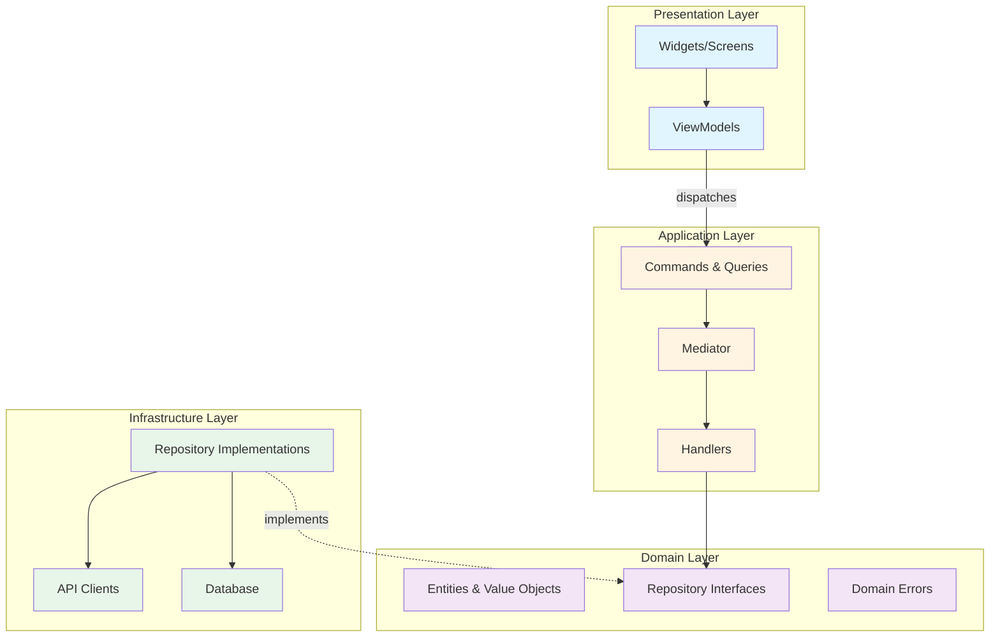
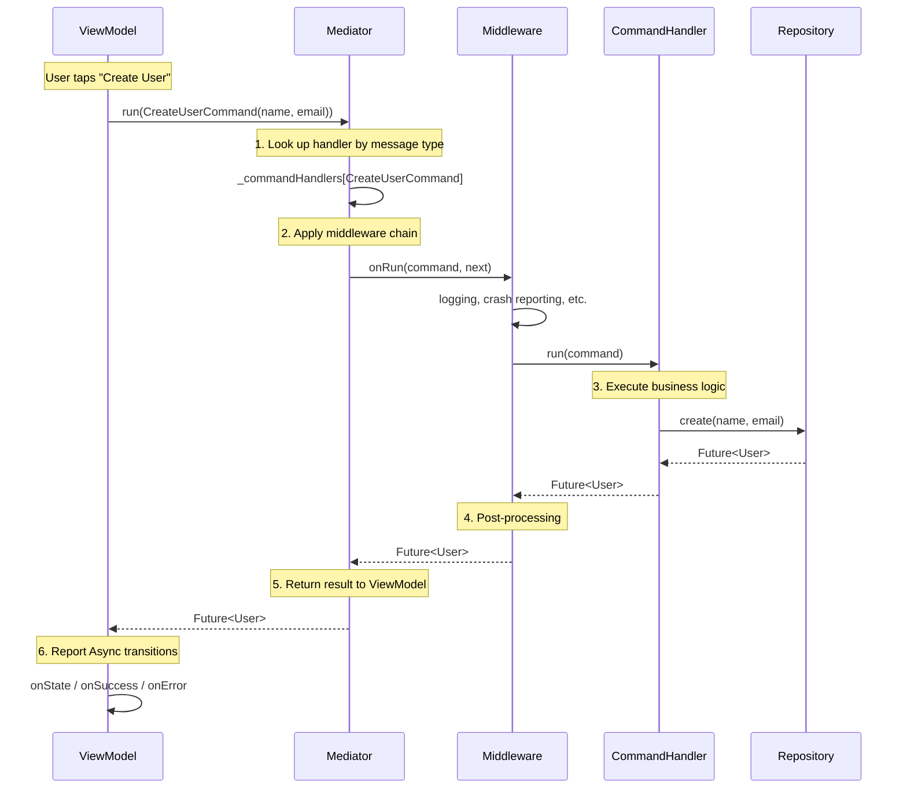

# Core Architecture

Chassis implements a layered architecture built on three foundational concepts: Layered Architecture, Command-Query Separation, and the Mediator Pattern. This guide explains how these principles work together to enforce clean separation of concerns and prevent common architectural mistakes.

## Layered Architecture

### The Four Layers

Chassis organizes code into four distinct layers, each with clearly defined responsibilities:

- **Presentation** (`presentation/`) — Widgets, ViewModels, State, Events. Depends on message types (application) and chassis_flutter.
- **Application** (`application/`) — Commands, Queries, Handlers. Depends on repository interfaces from domain.
- **Domain** (`domain/`) — Entities, value objects, repository interfaces, domain errors. Depends on nothing inside the project.
- **Infrastructure** (`infrastructure/`) — Repository implementations, third-party adapters. Depends on external SDKs; wired at the composition root.

Dependencies flow inward following the Dependency Rule. The Domain layer sits at the center and depends on nothing. The Application layer depends only on repository interfaces declared in the domain, never on concrete implementations. The Presentation layer depends on message types, dispatching them through the Mediator. The Infrastructure layer implements the domain's interfaces against external SDKs and is wired to the rest of the application only at the composition root. This inversion of control enables testing and flexibility, as you can substitute implementations without modifying consumers.



In your project structure, the recommended layout is feature-first — each feature owns its four layers (layer-first remains acceptable for small apps):

```
lib/
  ├── mediator.dart          # Composition root: @ChassisApp + handler imports
  ├── main.dart              # Chassis.initialize(AppMediator(...)) + runApp
  └── todos/                 # One feature, owning its four layers
      ├── presentation/      # Widgets, ViewModels, State, Events
      ├── application/       # Commands, Queries, Handlers
      ├── domain/            # Entities, repository interfaces, domain errors
      └── infrastructure/    # Repository implementations, adapters
```

### The Dependency Rule

The Dependency Rule states that source code dependencies must point inward, toward higher-level policies. In concrete terms, Handlers depend on repository interfaces rather than implementations. ViewModels depend only on message types — literally: a ViewModel holds no mediator field and no handler reference; it dispatches message objects. Widgets depend on ViewModels, not domain logic. This inversion of control enables testing, as you can substitute implementations without modifying consumers.

Consider how this works in practice. A Handler that creates users depends on a `UserRepository` interface declared in the domain layer:

```dart
// ✅ Correct: Handler depends on an abstraction from the domain layer
@chassisHandler
class CreateUserCommandHandler
    implements CommandHandler<CreateUserCommand, User> {
  CreateUserCommandHandler({required this.repository});

  final UserRepository repository; // Interface dependency

  @override
  Future<User> run(CreateUserCommand command) =>
      repository.create(command.name, command.email);
}

// ❌ Incorrect: Handler depends on a concrete implementation
class CreateUserCommandHandler {
  final FirestoreUserRepository _repository;  // Tight coupling
  // This prevents testing with fakes and locks you into Firestore
}
```

The interface abstraction allows you to test the Handler by providing a mock repository. No UI framework required, no database connection needed—just pure logic verification. This is the testability benefit of proper layering.

### Benefits of Layering

Each layer can be tested independently. Application logic tests run without a Flutter environment or database connection. You can swap a REST API repository for a GraphQL implementation without touching handlers or ViewModels, as both satisfy the same interface contract. Changes propagate predictably — a UI redesign affects only the Presentation layer, while a database migration impacts only the Infrastructure layer.

The ViewModel is architecturally restricted to being a transformation layer for the UI. It cannot accidentally implement business logic because it lacks direct access to repositories. It must dispatch a Command or Query, which creates a natural checkpoint where logic belongs in tested, reusable components. This prevention of logic leaks maintains the integrity of your architecture over time, even as teams grow and developers rotate.

For concrete testing examples demonstrating how to test each layer in isolation, see [Business Logic](02_business_logic.md#testing-strategy).

## Command-Query Separation

### The Principle

Command-Query Separation states that methods should either change state or return data, never both. In Chassis, this principle manifests through distinct message types. Commands represent intent to mutate state and may return result values like a created entity ID. Queries retrieve data without side effects and can be executed multiple times safely.

Strict CQS would have commands return nothing at all. Chassis deliberately relaxes that rule — `Command<R>` may carry a result — because UI flows routinely need the outcome of a mutation (create an entity, then navigate to it) and forcing a follow-up query for it would add latency and ceremony without adding safety. The Command/Query split still does its real job: signaling *intent to mutate* versus *side-effect-free read* in the type system.

This separation improves reasoning about side effects. When you see a Query in code, you know it's safe to call multiple times without unintended consequences. When you see a Command, you understand that state will change and execution should be deliberate. The type system enforces this distinction at compile time.

```dart
// Command: Mutates state, may return a result
final class UpdateUserEmailCommand extends Command<void> {
  UpdateUserEmailCommand({required this.userId, required this.newEmail});

  final String userId;
  final String newEmail;
}

// Query (Read): Fetches data without mutation
final class GetUserQuery extends ReadQuery<User> {
  GetUserQuery({required this.userId});

  final String userId;
}

// Query (Watch): Streams data without mutation
final class WatchUserQuery extends WatchQuery<User> {
  WatchUserQuery({required this.userId});

  final String userId;
}
```

### ReadQuery vs WatchQuery

Chassis extends Command-Query Separation by distinguishing one-time reads from reactive streams. ReadQuery serves situations where you need the current state once, such as fetching a user profile when a screen loads. WatchQuery handles scenarios requiring ongoing reactivity, like displaying real-time message counts or monitoring collaborative document changes.

This distinction enables routing to the appropriate handler type. Attempting to `watch` a ReadQuery — or to `read` a WatchQuery — is a compile error: each dispatch method accepts only its own query subtype.

```dart
// Inside a ViewModel:

// One-time fetch — a screen load, a pull-to-refresh
void loadUser(String userId) => read(
      GetUserQuery(userId: userId),
      onState: (user) => setState(state.copyWith(user: user)),
    );

// Continuous stream — the state follows every change
void watchUser(String userId) => watch(
      WatchUserQuery(userId: userId),
      onState: (user) => setState(state.copyWith(user: user)),
    );
```

### Practical Implications

A single Handler, such as LogoutCommandHandler, can be triggered from multiple ViewModels — Profile, Settings, or an account-deletion flow — without code duplication. The logic lives in one place and is reused by reference to the Command/Query type.

## The Mediator Pattern

### Pattern Overview

The Mediator pattern decouples objects by introducing an intermediary that handles their interactions. In Chassis, the Mediator sits between ViewModels and Handlers, managing the routing of messages. Instead of ViewModels calling Handlers directly, they dispatch message objects, and the mediator installed once at startup — `Chassis.initialize(AppMediator(...))` — looks up and invokes the appropriate Handler.

This decoupling provides several benefits. ViewModels depend only on message types, not handler implementations — and since 1.0 that statement is *literally* true: a ViewModel holds no mediator field of any kind, so its compile-time dependencies are exactly the message classes it dispatches plus the `ViewModel` base class. The Mediator maintains a catalog of handlers, enabling runtime introspection of application capabilities. You can swap handler implementations without modifying ViewModels, as the Mediator handles the routing indirection.

Compare the traditional approach with the message-direct approach:

```dart
// Without Mediator (tight coupling)
class UserViewModel {
  final CreateUserCommandHandler _createHandler;
  final GetUserQueryHandler _getHandler;

  UserViewModel(this._createHandler, this._getHandler); // Grows with every operation

  void createUser(String name, String email) {
    _createHandler.run(CreateUserCommand(name: name, email: email));
  }
}

// With Chassis (message-direct)
class UserViewModel extends ViewModel<UserState, UserEvent> {
  UserViewModel({super.mediator}) : super(UserState.initial());

  void createUser(String name, String email) => run(
        CreateUserCommand(name: name, email: email),
        onSuccess: (_) => sendEvent(const UserCreatedEvent()),
        onError: (error, stack) => sendEvent(UserCreationFailedEvent(error)),
      );
}
```

The `mediator` constructor parameter is the testing seam — `UserViewModel(mediator: fakeMediator)` overrides the globally installed mediator, so tests never touch `Chassis.initialize`. In production, nobody passes it; the ViewModel resolves the installed mediator lazily at its first dispatch.

### Message Flow

When a ViewModel calls `run(command)`, several steps occur behind the scenes. The ViewModel resolves the installed mediator and dispatches the message. The Mediator performs type-based lookup in its handler registry to find the appropriate CommandHandler. Middleware executes in the order registered, forming a processing pipeline for cross-cutting concerns like logging or crash reporting. The matched Handler receives the command and executes its business logic, coordinating with repositories as needed. Finally, the result flows back through the middleware chain to the ViewModel, which reports it as `Async` state transitions through the callbacks.



Handler registration happens at application startup: `main()` constructs the generated mediator — whose constructor registers every handler — and installs it with `Chassis.initialize` before `runApp`. Wiring mistakes surface immediately and unambiguously: registering two handlers for the same message type throws a `DuplicateHandlerError`, and dispatching a message that has no registered handler throws a `HandlerNotRegisteredError` with an actionable message. Both extend the sealed `ChassisError` type — Dart `Error`s, not `Exception`s, because they signal programming errors to fix, never runtime conditions to catch — and behave identically in debug and release builds. In a generated setup, `HandlerNotRegisteredError` should rarely survive to runtime at all: a reachable message without a handler already fails the *build* (see [Code Generation](03_code_generation.md#missing-handlers-fail-the-build)). At the ViewModel call site, a dispatch failure surfaces as an `AsyncError` — the UI never crashes mid-frame — but the wiring bug remains a bug: the only correct response is fixing the registration.

### Type Safety and Discoverability

Type safety travels with the message itself. `Command<R>`, `ReadQuery<R>`, and `WatchQuery<R>` carry their result type as a type parameter, so `run(CreateUserCommand(...))` infers `User` end to end — no casts at the call site, whatever routing happens in between.

The generated mediator adds no API surface of its own. It is a registration constructor and nothing else: handler dependencies in, handlers registered, dispatch through the `run`/`read`/`watch` it inherits from `Mediator`:

```dart
// Generated by chassis_builder from @ChassisApp — registration only:
class AppMediator extends Mediator {
  AppMediator({required UserRepository userRepository}) {
    registerCommandHandler(CreateUserCommandHandler(repository: userRepository));
    registerQueryHandler(GetUserQueryHandler(repository: userRepository));
    registerQueryHandler(WatchUsersQueryHandler(repository: userRepository));
  }
}
```

Discoverability therefore lives where the operations are declared, not on a generated class: your application's capabilities are the catalog of Command and Query classes in its `application/` folders. To understand what a feature can do, examine its message types. This differs fundamentally from traditional architectures where capabilities are scattered across controller methods with no central catalog — and it holds across packages, too: a shared feature package's message types *are* its contract, and `@chassisModule` exists solely so the generator can discover that package's handlers (see [Code Generation](03_code_generation.md#modules-cross-package-handler-discovery); single-package apps never need modules).

What backs the catalog is a build-time guarantee: every concrete message reachable from the composition root must have a handler, or the build fails listing the orphans. "Does a handler exist for this message?" is proven at the declaration site, once for the whole application — see [Code Generation](03_code_generation.md#missing-handlers-fail-the-build).

A developer can look at the list of Command and Query classes to understand exactly what the application does, without diving into implementation details. This "code as documentation" quality improves maintainability as teams scale and new developers join projects.

### Middleware

Middleware intercepts messages before they reach handlers, enabling cross-cutting concerns to be implemented once rather than duplicated across handlers. Common use cases include logging, crash reporting, performance monitoring, and caching. Middleware executes in the order registered, forming a processing pipeline that every message flows through. The middleware chain is chassis's observability channel — there is no `BlocObserver`/`ProviderObserver` equivalent, by design: a middleware sees the typed message, its `params`, and its outcome, and is wired once at the composition root.

Chassis ships a ready-made `LoggingMiddleware` that traces every operation — dispatch, outcome, duration, and errors with stack traces — and a `CrashReportingMiddleware` that reports every failure crossing the mediator to your crash reporter, then rethrows (reporting never swallows failures):

```dart
Chassis.initialize(
  AppMediator(/* dependencies */)
    ..addMiddleware(LoggingMiddleware())
    ..addMiddleware(CrashReportingMiddleware(
      (error, stack, {required fatal}) => FirebaseCrashlytics.instance
          .recordError(error, stack, fatal: fatal),
    )),
);
```

`CrashReportingMiddleware` classifies failures with Dart's own distinction: an `Error` (a `TypeError` in a handler, a chassis wiring error) is a programming bug and reports as **fatal**; anything else (domain exceptions, expected runtime failures) reports as non-fatal. Each `LoggingMiddleware` trace renders the message's `params` (`CreateUserCommand{name: John}` instead of a bare type name), so override `params` on your commands and queries to make logs useful — and never include secrets in them. Records can be routed to any logger by providing a custom `ChassisLogSink`.

For custom concerns, extend `MediatorMiddleware` and override the hooks you need — `onRun` for commands, `onRead` for one-shot queries, `onWatch` for streaming queries. Each hook receives the message through its abstract base type and has a pass-through default:

```dart
class AuditMiddleware extends MediatorMiddleware {
  AuditMiddleware(this._audit);

  final AuditService _audit;

  @override
  Future<R> onRun<R>(Command<R> command, NextRun<R> next) async {
    await _audit.record(command);
    return next(command);
  }

  @override
  Future<R> onRead<R>(ReadQuery<R> query, NextRead<R> next) async {
    await _audit.record(query);
    return next(query);
  }

  @override
  Stream<R> onWatch<R>(WatchQuery<R> query, NextWatch<R> next) {
    unawaited(_audit.record(query));
    return next(query);
  }
}
```

```dart
mediator.addMiddleware(AuditMiddleware(auditService));
```

Note the shape difference: `onRun` and `onRead` return a `Future`, so the middleware can await work before and after the handler. `onWatch` returns the `Stream` synchronously — async work at subscription time must be fire-and-forget, and per-event concerns are handled by wrapping the returned stream (as the shipped `LoggingMiddleware` does to trace each emission).

#### Middleware observes the pipeline — it never drives it

A middleware wraps dispatch; it must not *initiate* dispatch. The classic temptation is an `ExpiredSessionMiddleware` that catches authentication failures and fires a logout command back through the mediator. That design is infrastructure logic in disguise, and it buys re-entrance for free: the triggered command traverses the same middleware, and if it fails with the same error, the middleware re-fires it forever. The same boundary applies to handlers — a handler composes repositories and services, it does not dispatch other commands or queries. The rule is not advisory: the generator rejects a `Mediator`-typed handler dependency at build time (see [Code Generation](03_code_generation.md#build-time-guarantees)), because handler-to-handler dispatch hides the dependency graph from constructor signatures and re-enters the middleware chain, turning one user gesture into several units of work for logging, transaction, or retry middleware.

Session expiry, the canonical example, is solved one layer down. The HTTP client detects the expired session once, at the source, and surfaces it through the auth repository's state:

```dart
// Infrastructure: the API client's interceptor detects the 401.
void onError(HttpError error) {
  if (error.statusCode == 401) {
    _authRepository.markSessionExpired();
  }
}
```

The repository emits the change on its authentication-state stream, a `WatchAuthStateQuery` carries it to the presentation layer, and the router redirects to the login screen when the state becomes unauthenticated. Each layer does its own job — infrastructure detects, the repository owns the state, the UI reacts — and `LogoutCommandHandler` remains what it always was: a use case triggered by user actions.

### Composing Multi-Step Flows

If handlers never dispatch, where does a multi-step flow live? There are exactly two homes for it, and one criterion decides between them: **is the follow-up a step of this operation, or a standing reaction to state?**

**The UI awaits the composite result — orchestrate in one handler.** When the steps must run in order, any failure must surface to the caller, and the screen shows a single loading state for the whole flow, the flow is one use case, so it is one Command. Its handler is the Application-layer orchestrator: it injects every port the flow needs and coordinates them.

```dart
@chassisHandler
class LoginCommandHandler implements CommandHandler<LoginCommand, void> {
  LoginCommandHandler({
    required this.authRepository,
    required this.profileRepository,
  });

  final AuthRepository authRepository;
  final ProfileRepository profileRepository;

  @override
  Future<void> run(LoginCommand command) async {
    await authRepository.login(command.username, command.password);
    await profileRepository.refresh();
  }
}
```

The sequencing is explicit, each step's error propagates to the dispatching ViewModel as one `AsyncError`, and the whole flow appears as a single traced operation in the logging middleware.

**The follow-up is ambient synchronization — push the reactivity into the repository.** When a piece of state must simply stay in sync with another *no matter why it changed* — the profile cache follows the authenticated user, whether the change came from a login, a logout, a token expiry, or another device — sequencing it inside one handler would miss every change that handler didn't cause. Solve it in the Infrastructure layer: the derived repository observes the source repository's stream.

```dart
class CachedProfileRepository implements ProfileRepository {
  CachedProfileRepository({required AuthRepository authRepository}) {
    _subscription = authRepository.watchAuthState().listen((auth) {
      if (auth == null) {
        _clearCache();
      } else {
        _refreshFor(auth.userId);
      }
    });
  }

  late final StreamSubscription<AuthState?> _subscription;

  // ...
}
```

No layer orchestrates anything: the invariant "the profile cache follows auth state" holds by construction.

The reactive variant costs traceability, and the cost is worth naming: the synchronization never crosses the mediator, so the flow is not visible in any single handler, and the logging middleware will not show it — it is discoverable only by reading the repository's constructor. Accept that trade-off for ambient invariants, where the decentralization is the point. Keep user-initiated sequences in a handler, where every step is part of one traced, awaitable operation.

## Summary

These three principles—Layered Architecture, Command-Query Separation, and the Mediator Pattern—combine to create a framework where architectural intent is enforced at the code level. The layering prevents logic leaks by restricting what each layer can access. Command-Query Separation makes side effects explicit and enables optimization opportunities. The Mediator decouples senders from receivers — ViewModels depend on nothing but message types — while type safety travels with the messages and the build refuses any message without a handler.

While other state management solutions allow developers to place logic anywhere—in Widgets, Controllers, or Services arbitrarily—Chassis enforces a specific path: UI → ViewModel → Command → Mediator → Handler → Repository. This guardrail over guidelines approach ensures that a junior developer and a senior architect produce code with the same structural footprint, reducing code review friction and technical debt accumulation.

With this foundation, the subsequent sections explore implementation details: writing business logic manually in [Business Logic](02_business_logic.md), automating boilerplate with code generation in [Code Generation](03_code_generation.md), and integrating with Flutter's widget tree in [UI Integration](04_ui_integration.md).
