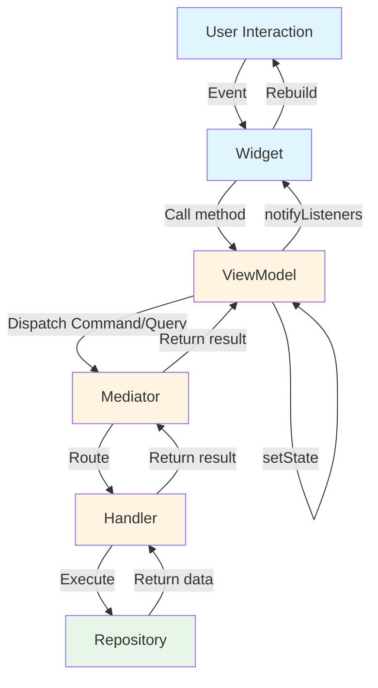

# UI Integration

This guide focuses on the Presentation layer—connecting business logic to Flutter widgets through ViewModels, reactive state management, and event handling. You'll learn how ViewModels transform domain data into UI-ready state, how AsyncBuilder renders asynchronous data without manual state checking, and how to handle one-time events like navigation or snackbars. By the end, you'll understand the unidirectional data flow pattern that makes UI complexity scale linearly with feature complexity rather than exponentially.

## The ViewModel Pattern

### Role and Responsibilities

In the Chassis architecture, ViewModels serve as the bridge between business logic and the widget tree, as explained in the layered architecture from [Core Architecture](01_core_architecture.md#layered-architecture). Their primary responsibility is state transformation—converting raw domain data into a format the UI can render directly without additional processing. Unlike traditional controllers that might manipulate widgets, ViewModels emit state changes and widgets rebuild reactively in response.

ViewModels manage three distinct concerns. First, they hold the current UI state and notify listeners when it changes through Flutter's ChangeNotifier mechanism. Second, they translate user actions into Commands or Queries and dispatch them through the Mediator. Third, they emit events for one-time occurrences like showing snackbars or navigating, keeping these separate from persistent state.

```dart
class UserProfileState {
  const UserProfileState({
    required this.user,
    required this.isEditing,
  });

  final Async<User> user;
  final bool isEditing;

  UserProfileState copyWith({
    Async<User>? user,
    bool? isEditing,
  }) {
    return UserProfileState(
      user: user ?? this.user,
      isEditing: isEditing ?? this.isEditing,
    );
  }

  static UserProfileState initial() {
    return UserProfileState(
      user: Async.loading(),
      isEditing: false,
    );
  }
}

sealed class UserProfileEvent {}

class UserUpdatedEvent implements UserProfileEvent {
  const UserUpdatedEvent();
}

class UserUpdateFailedEvent implements UserProfileEvent {
  const UserUpdateFailedEvent(this.message);
  final String message;
}

class UserProfileViewModel extends ViewModel<UserProfileState, UserProfileEvent> {
  UserProfileViewModel(this._mediator) : super(UserProfileState.initial());

  final AppMediator _mediator;

  void loadUser(String userId) {
    // onState receives every transition: loading, data, and error.
    // The key makes a later call with a new userId replace this subscription;
    // current carries the existing data through the loading emission.
    watch(
      _mediator.watchUser(userId: userId),
      key: #user,
      current: state.user,
      onState: (asyncUser) {
        setState(state.copyWith(user: asyncUser));
      },
    );
  }

  void updateEmail(String userId, String newEmail) {
    // onSuccess/onError fire additively for their respective outcome
    run(
      () => _mediator.updateUserEmail(userId: userId, newEmail: newEmail),
      onSuccess: (_) => sendEvent(UserUpdatedEvent()),
      onError: (error) => sendEvent(UserUpdateFailedEvent(error.toString())),
    );
  }

  void toggleEditMode() {
    setState(state.copyWith(isEditing: !state.isEditing));
  }
}
```

State immutability ensures predictable behavior. The `copyWith` pattern creates new state objects rather than mutating existing ones, which simplifies debugging and prevents subtle bugs from shared mutable state. Local UI state like `isEditing` lives in the ViewModel, while domain data like user profiles flows through the Mediator from handlers. The ViewModel keeps a field typed as the generated `AppMediator` so it can call the typed dispatch methods; only the initial state is passed to `super`.

### Unidirectional Data Flow

Chassis enforces unidirectional data flow where user interactions flow upward as Commands or Queries, and data flows downward as state updates. This pattern prevents bidirectional dependencies that complicate debugging and testing. Widgets never call repositories directly, and repositories never know about ViewModels, creating a clean separation of concerns.



This pattern creates a predictable loop: interaction → command → handler → repository → state update → widget rebuild. Data flows in one direction, making it easy to trace how user actions affect state and how state changes trigger UI updates. If the UI displays incorrect data, you can trace backward through this flow—check the state, check ViewModel updates, check handler logic, check repository implementation.

Unlike traditional controllers that might manipulate widgets directly, a Chassis ViewModel relies exclusively on state mutation. When a user taps a button, the ViewModel does not modify the view directly. Instead, it dispatches a command to the Mediator and updates its internal state based on the result. The widget observes this state change and rebuilds accordingly.

### Lifecycle Methods

ViewModels provide two methods for handling asynchronous operations: `run()` for futures and `watch()` for streams. `run()` takes a closure returning a `Future<T>` (typically a call to a typed method of the generated mediator) so that dispatch can be deferred or skipped by a `RunPolicy`; `watch()` takes a raw `Stream<T>`. Both provide callbacks to handle state updates.

#### The watch() Method

The `watch()` method subscribes to a stream, calling the provided callbacks as the stream emits. Subscription management happens automatically—the ViewModel disposes subscriptions when it disposes, preventing memory leaks. Use watch for data that changes over time, like todo lists, presence indicators, or collaborative document state.

```dart
class ExampleViewModel extends ViewModel<ExampleState, ExampleEvent> {
  // Using onState for full lifecycle control
  void watchUser(String userId) {
    watch(
      _mediator.watchUser(userId: userId),
      key: #user,
      current: state.user,
      onState: (asyncUser) {
        setState(state.copyWith(user: asyncUser));
      },
    );
  }
}
```

Two optional parameters shape the subscription's behavior:

- **`key:`** — a new `watch()` with the same key cancels and replaces the previous subscription. This is the canonical way to re-watch when arguments change (`key: #user` above: calling `watchUser` with a new id swaps the subscription instead of stacking a second one). Without a key, subscriptions are additive and live until the ViewModel is disposed or the returned `WatchHandle` is cancelled.
- **`current:`** — the current `Async<T>` state, if any. The initial loading emission and error transitions carry its data, so a re-watch never blanks the UI.
- **`emitLoading:`** — whether to emit an `AsyncLoading` immediately on subscription (default `true`). Pass `false` when re-watching in the background and the UI should keep rendering the current data untouched until fresh data arrives.
- **`onDone:`** — invoked when the stream itself completes, never on cancellation (keyed replacement, `WatchHandle.cancel`, or disposal). Infinite streams (Firestore-style watchers) never trigger it; for finite streams it is the only signal that no further emissions will come — without it the state stays frozen on the last data. The subscription is released before `onDone` runs, so starting a replacement `watch()` under the same key from inside the callback is safe.

If the stream itself emits an error, `watch()` reports a *soft error*: the emitted `AsyncError` carries the last known data, keeping content on screen through transient stream failures.

#### The run() Method

The `run()` method executes an async operation and handles the result, commonly used for one-time operations like data fetches or commands. Use this for initial data loads, mutations, or any operation that completes once rather than streaming updates. It accepts the same `current:` and `emitLoading:` parameters as `watch()` (`emitLoading: false` makes a background refresh silent until it completes) and returns the final `Async<R>` state.

```dart
class ExampleViewModel extends ViewModel<ExampleState, ExampleEvent> {
  // Using onState for one-time fetch; current carries data through a refetch
  void loadUser(String userId) {
    run(
      () => _mediator.getUser(userId: userId),
      current: state.user,
      onState: (asyncUser) {
        setState(state.copyWith(user: asyncUser));
      },
    );
  }

  // Using onSuccess/onError for command execution
  void deleteUser(String userId) {
    run(
      () => _mediator.deleteUser(userId: userId),
      onSuccess: (_) => sendEvent(UserDeletedEvent()),
      onError: (error) => sendEvent(UserDeleteFailedEvent(error.toString())),
    );
  }
}
```

#### Concurrency: key and RunPolicy

Two overlapping `run()` calls writing to the same state field race: the last completion wins, and that may be the *oldest* dispatch (network timing is arbitrary). Give such runs a `key` and a `RunPolicy` to decide who wins:

```dart
// Search field: latest wins, and bursts of keystrokes coalesce.
void search(String terms) {
  run(
    () => _mediator.searchUsers(terms: terms),
    key: #search,
    policy: const RunPolicy.restartable(debounce: Duration(milliseconds: 300)),
    current: state.results,
    onState: (results) => setState(state.copyWith(results: results)),
  );
}

// Submit button: first wins, a double-tap cannot dispatch twice.
void submitOrder() {
  run(
    () => _mediator.submitOrder(cart: state.cart),
    key: #submit,
    policy: const RunPolicy.droppable(),
    onSuccess: (_) => sendEvent(OrderSubmittedEvent()),
    onError: (error) => sendEvent(OrderFailedEvent(error.toString())),
  );
}
```

A policy answers one question — when several runs collide on a key, who wins?

| Policy | Who wins | Typical use |
|--------|----------|-------------|
| `RunPolicy.concurrent()` (default) | Everyone — results may interleave | Independent operations that never write the same field |
| `RunPolicy.restartable({debounce})` | The latest — in-flight callbacks are invalidated; an optional `debounce` window coalesces bursts before dispatching | Refetches, search-as-you-type |
| `RunPolicy.droppable()` | The first — later calls don't dispatch and resolve with the in-flight result | Submit buttons, anything a double-tap must not repeat |
| `RunPolicy.sequential()` | Everyone, in call order (queued per key) | Ordered mutations |

There is no separate "debounce" policy: debouncing alone would not fix result races (two dispatches separated by more than the window can still complete out of order), so the debounce window is a parameter of `restartable`. Every policy except `concurrent` requires a `key`, and all runs sharing a key must have the same result type. Superseded and dropped calls still resolve — with their own result (`restartable`) or the winner's (`droppable`, coalesced `debounce`) — so awaiting `run()` is always safe.

`watch()` gets the same protection from its `key` parameter: a new keyed watch replaces the previous subscription.

#### Callback Patterns

Both `run()` and `watch()` share one callback contract:

- `onState` (if provided) fires for **every** transition — loading, data, and error — with the corresponding `Async<T>` value.
- `onSuccess` (on `run`) / `onData` (on `watch`) and `onError` are **additive** conveniences, invoked *after* `onState` for their respective transition. Providing them never suppresses `onState`. They carry the same value — a `run` result is a *success*, a `watch` emission is *data*.
- At least one callback must be provided.
- Callbacks run outside the framework's error handling: an exception thrown by your callback is a bug in the callback and propagates as such — it is never converted into an `AsyncError`.

Choose the combination that matches the call site:

**onState** - Full lifecycle control with `Async<T>`:
```dart
run(
  () => _mediator.getUser(userId: userId),
  onState: (asyncUser) {
    // Receives Async<User> for all states (loading, data, error)
    setState(state.copyWith(user: asyncUser));
  },
);
```

Use `onState` when you need to handle the complete async lifecycle in your state, such as showing loading indicators or maintaining previous data during refetches.

**onSuccess** - Success callback with the unwrapped value:
```dart
run(
  () => _mediator.createUser(name: name, email: email),
  onSuccess: (user) {
    // Called on success with the unwrapped User
    setState(state.copyWith(user: Async.data(user)));
    sendEvent(UserCreatedEvent(user));
  },
);
```

Use `onSuccess` when you only care about successful results and want to work with the unwrapped value directly. (`watch` names the equivalent callback `onData`: a stream emission is data, not a success.)

**onError** - Failure callback with the raw error:
```dart
run(
  () => _mediator.updateUser(userId: userId, data: data),
  onError: (error) {
    // Called on failure
    sendEvent(UpdateFailedEvent(error.toString()));
  },
);
```

Use `onError` for error handling, often combined with `onSuccess` for clean separation of success and failure cases.

**Combined callbacks**:
```dart
run(
  () => _mediator.deleteUser(userId: userId),
  onSuccess: (_) => sendEvent(UserDeletedEvent()),
  onError: (error) => sendEvent(UserDeleteFailedEvent(error.toString())),
);
```

Combine `onSuccess` and `onError` when you need different behavior for success and failure but don't need to handle the loading state explicitly. Because the callbacks are additive, you can also keep `onState` alongside them — for example to mirror the full lifecycle in state while dispatching one-time events on the outcome.

#### Resource Lifecycle Helpers

Beyond `run()`/`watch()`, the `BaseUtils` extension ties arbitrary resources to the ViewModel's lifecycle, so cleanup lives on the line that creates the resource instead of accumulating in `dispose()`:

```dart
class ExampleViewModel extends ViewModel<ExampleState, ExampleEvent> {
  ExampleViewModel(this._mediator, TextEditingController controller)
      : super(ExampleState.initial()) {
    // Removes the listener automatically on dispose.
    listenTo(controller, _onTextChanged);

    // Listens to several Listenables as one; same automatic cleanup.
    mergeAndListenTo([controllerA, controllerB], _recompute);

    // Disposes any Disposable / cancels a raw subscription on dispose.
    autoDispose(someDisposable);
    autoDisposeStreamSubscription(someStream.listen(_onData));
  }
}
```

## Modeling State with Async<T>

### The Async<T> Type

Async<T> is a sealed class representing the complete lifecycle of an asynchronous operation, ensuring UI handles all possibilities—loading, success, and error. This eliminates bugs where loading states are forgotten or error conditions go unhandled. The sealed class guarantees exhaustive pattern matching, where Dart's type system requires handling all three cases.

```dart
sealed class Async<T> {
  const Async();

  T? get valueOrNull;
  Object? get errorOrNull;
  bool get isLoading;
  bool get hasValue;
  bool get hasError;
  T get requireValue;

  // Factories
  const factory Async.data(T value) = AsyncData<T>;
  const factory Async.loading({AsyncData<T>? previous}) = AsyncLoading<T>;
  const factory Async.error(Object error,
      {StackTrace? stackTrace, AsyncData<T>? previous}) = AsyncError<T>;
}

class AsyncData<T> extends Async<T> {
  const AsyncData(this.value);
  final T value;
}

class AsyncLoading<T> extends Async<T> {
  const AsyncLoading({this.previous});
  final AsyncData<T>? previous;  // Last successful state, for anti-flickering
}

class AsyncError<T> extends Async<T> {
  const AsyncError(this.error, {this.stackTrace, this.previous});
  final Object error;
  final StackTrace? stackTrace;
  final AsyncData<T>? previous;  // Last successful state, for soft errors
}
```

AsyncLoading and AsyncError can optionally retain the previous successful state, enabling the UI to show stale data during refetches or display previous values alongside error messages. This anti-flickering capability improves user experience significantly, as discussed in the AsyncBuilder section.

Note that `previous` is a full `AsyncData<T>`, not a bare `T?`. Carrying the whole state makes "a value existed" provable by the type system even when `T` is nullable and the value itself is `null`: `Async<int?>.data(null)` has `hasValue == true`. For the same reason, prefer `hasValue` (or pattern matching) over null-checking `valueOrNull` when `T` is nullable. All variants implement `==` and `hashCode`, so state comparisons behave as expected.

### Pattern Matching

Dart 3's pattern matching makes working with Async<T> concise and type-safe. The sealed class ensures exhaustive checking—the compiler requires handling all three cases when switching on Async<T> values.

```dart
// In ViewModel - Using onState with pattern matching
void loadUser(String userId) {
  run(
    () => _mediator.getUser(userId: userId),
    onState: (asyncUser) {
      switch (asyncUser) {
        case AsyncLoading():
          setState(state.copyWith(user: asyncUser));
        case AsyncData(:final value):
          setState(state.copyWith(user: asyncUser));
          sendEvent(UserLoadedEvent(value));
        case AsyncError(:final error):
          setState(state.copyWith(user: asyncUser));
          sendEvent(UserLoadFailedEvent(error.toString()));
      }
    },
  );
}

// Or using additive onSuccess/onError for cleaner code
void loadUser(String userId) {
  run(
    () => _mediator.getUser(userId: userId),
    onState: (asyncUser) => setState(state.copyWith(user: asyncUser)),
    onSuccess: (user) => sendEvent(UserLoadedEvent(user)),
    onError: (error) => sendEvent(UserLoadFailedEvent(error.toString())),
  );
}

// Or using if-case for specific scenarios
if (asyncUser case AsyncData(:final value)) {
  // Guaranteed non-null value in this scope
  print('User name: ${value.name}');
}
```

Pattern matching extracts values safely. The compiler guarantees that `value` is non-null within the `AsyncData` case, eliminating defensive null checks. This type safety prevents runtime errors and makes code more maintainable.

### Fluent State Transitions

Async<T> provides fluent methods for common state transitions, simplifying how ViewModels update state as operations progress through their lifecycle.

```dart
// Transition to loading while keeping current data (refetch)
final refetching = currentState.toLoading();  // AsyncLoading(previous: currentData)

// Transition to data (success)
final success = currentState.toData(newUser);  // AsyncData(newUser)

// Transition to error while keeping current data (soft error)
final softError = currentState.toError(exception, stackTrace);  // AsyncError(..., previous: currentData)
```

These methods preserve previous data when appropriate, enabling the UI to maintain display during refetches or show stale data with error overlays. This pattern supports the anti-flickering behavior that improves user experience during data refreshes.

### Combinators: when() and map()

Beyond pattern matching, `Async<T>` ships two combinators for the everyday transformations:

`when()` folds the state into a single value, exhaustively — the expression-friendly alternative to a `switch` when you produce a value rather than a widget branch. `data` receives only fresh values (`AsyncData`); a value merely *carried* by a loading or error state does not count as data here — read `valueOrNull` inside `loading`/`error` if you want it:

```dart
final label = state.user.when(
  data: (user) => user.name,
  loading: () => 'Loading…',
  error: (e, _) => 'Failed: $e',
);
```

`map()` transforms the value while preserving the state — loading stays loading, an error keeps its error and stack trace, and any carried `previous` data is transformed too. This is the right tool for deriving a projection of a larger async state without re-implementing the three-way branching:

```dart
// Async<User> → Async<String>, preserving loading/error/previous.
final Async<String> name = state.user.map((user) => user.name);
```

Also worth knowing: `hasValue` (true when a value exists, fresh or carried — correct even for nullable `T`), `valueOrNull`, and `requireValue` (throws with an actionable message when no value exists).

## AsyncBuilder Widget

### Basic Usage

AsyncBuilder is a StatelessWidget that renders different UI based on Async<T> state, eliminating manual state checking in build methods. It takes an Async<T> state and three builders—one for data, one for loading, and one for errors—automatically selecting the appropriate builder based on current state.

```dart
class UserProfileScreen extends StatelessWidget {
  const UserProfileScreen({Key? key}) : super(key: key);

  @override
  Widget build(BuildContext context) {
    // select subscribes this widget to just the field it renders:
    // unrelated state changes don't trigger a rebuild.
    final asyncUser = context.select(
      (UserProfileViewModel vm) => vm.state.user,
    );

    return Scaffold(
      appBar: AppBar(title: const Text('User Profile')),
      body: AsyncBuilder<User>(
        state: asyncUser,
        builder: (context, user) {
          // Renders when data is available
          return Column(
            children: [
              CircleAvatar(
                backgroundImage: NetworkImage(user.avatarUrl),
                radius: 50,
              ),
              const SizedBox(height: 16),
              Text(user.name, style: Theme.of(context).textTheme.headlineMedium),
              Text(user.email),
              const SizedBox(height: 24),
              Text('Member since ${user.createdAt.year}'),
            ],
          );
        },
        loadingBuilder: (context) {
          // Renders during initial load
          return const Center(child: CircularProgressIndicator());
        },
        errorBuilder: (context, error) {
          // Renders on error with no previous data
          return Center(
            child: Column(
              mainAxisAlignment: MainAxisAlignment.center,
              children: [
                const Icon(Icons.error, size: 48, color: Colors.red),
                const SizedBox(height: 16),
                Text('Error loading profile: $error'),
                ElevatedButton(
                  // read (not watch/select) inside callbacks: no subscription
                  onPressed: () =>
                      context.read<UserProfileViewModel>().loadUser('userId'),
                  child: const Text('Retry'),
                ),
              ],
            ),
          );
        },
      ),
    );
  }
}
```

The `builder` callback receives the unwrapped User object. No null checks are required—AsyncBuilder only calls this builder when data is available and successfully unwrapped. Custom `loadingBuilder` and `errorBuilder` provide branded loading and error experiences tailored to your application's design.

### Anti-Flickering with maintainState

The `maintainState` parameter, which defaults to `true`, prevents flickering during refetches by showing previous data during loading states instead of the loading widget. This creates a much smoother user experience, especially for pull-to-refresh scenarios.

```dart
AsyncBuilder<User>(
  state: context.select((UserProfileViewModel vm) => vm.state.user),
  maintainState: true,  // Default behavior
  builder: (context, user) {
    // Shows previous user data during refetch
    return UserCard(user: user);
  },
  loadingBuilder: (context) {
    // Only shown on INITIAL load when no data exists
    return const CircularProgressIndicator();
  },
)
```

Consider the visual flow through different states. On initial load with `Async.loading()` and no previous data, the `loadingBuilder` renders showing a spinner. After first load with `Async.data(user)`, the `builder` renders displaying the user profile. On refetch with `AsyncLoading(previous: AsyncData(user))`, the `builder` continues rendering with previous user data—no flicker to loading state. When refetch completes with `Async.data(newUser)`, the `builder` renders with updated user data, smoothly transitioning from old to new.

Producing the carrying states is the framework's job, not yours: pass `current: state.user` to `run()` or `watch()` and the loading and error emissions automatically carry the existing data (equivalent to calling `state.user.toLoading()` yourself).

This pattern is ideal for pull-to-refresh scenarios where showing stale data during refresh provides better UX than a loading spinner. Users see their data immediately and can continue interacting while fresh data loads in the background. When fresh data arrives, the UI updates smoothly without jarring transitions.

## Handling One-Time Events

### State vs Events

A fundamental architectural distinction in Chassis is between persistent state and ephemeral events. State represents data that determines what the UI renders at any moment—user profiles, form field values, lists of items, loading indicators. If the user rotates their device or navigates away and back, this state should persist and restore the same display.

Events represent one-time occurrences that should not be replayed if the UI rebuilds. They trigger side effects like navigation, snackbars, dialogs, or vibrations. A "User created successfully" event shows a snackbar once, not every time the widget rebuilds. A "Payment failed" event shows an error dialog once. A "Login succeeded" event navigates to the home screen once.

```dart
// State - Persistent
class CheckoutState {
  const CheckoutState({
    required this.cart,
    required this.shippingAddress,
    required this.isProcessingPayment,
  });

  final Async<List<CartItem>> cart;
  final Address? shippingAddress;
  final bool isProcessingPayment;
}

// Events - Ephemeral
sealed class CheckoutEvent {}

class PaymentSuccessEvent implements CheckoutEvent {
  const PaymentSuccessEvent(this.orderId);
  final String orderId;
}

class PaymentFailedEvent implements CheckoutEvent {
  const PaymentFailedEvent(this.reason);
  final String reason;
}

class NavigateToOrderConfirmationEvent implements CheckoutEvent {
  const NavigateToOrderConfirmationEvent(this.orderId);
  final String orderId;
}
```

State determines what appears on screen right now. Events describe what should happen once in response to an action. This separation prevents bugs where snackbars show repeatedly or navigation happens multiple times due to widget rebuilds.

### Listening to Events

`ViewModelProvider.withEventListener` is the preferred way to listen to a ViewModel's events. It creates the ViewModel, subscribes to its event stream, and invokes your callback for each emitted event — all in one place, with automatic subscription cleanup tied to the provider's lifetime.

```dart
ViewModelProvider.withEventListener<CheckoutViewModel, CheckoutEvent>(
  create: (_) => CheckoutViewModel(mediator),
  onEvent: (context, viewModel, event) {
    switch (event) {
      case PaymentSuccessEvent(:final orderId):
        ScaffoldMessenger.of(context).showSnackBar(
          SnackBar(content: Text('Payment successful! Order #$orderId')),
        );

      case PaymentFailedEvent(:final reason):
        showDialog(
          context: context,
          builder: (context) => AlertDialog(
            title: const Text('Payment Failed'),
            content: Text(reason),
            actions: [
              TextButton(
                onPressed: () => Navigator.pop(context),
                child: const Text('OK'),
              ),
            ],
          ),
        );

      case NavigateToOrderConfirmationEvent(:final orderId):
        Navigator.pushReplacement(
          context,
          MaterialPageRoute(
            builder: (context) => OrderConfirmationScreen(orderId: orderId),
          ),
        );
    }
  },
  child: const CheckoutScreen(),
);
```

The `context` passed to `onEvent` is the provider's own context — above the ViewModel it creates — so `ScaffoldMessenger.of(context)` and `Navigator.of(context)` work, but `context.read<CheckoutViewModel>()` does not. Use the `viewModel` callback argument when you need the VM itself. Pattern matching on sealed event types ensures exhaustive handling: the compiler requires handling all event types defined in the sealed hierarchy.

Note that `.withEventListener` creates the ViewModel eagerly (unlike the default constructor which is lazy), so events emitted during construction are not missed.

#### EventListener for descendant listeners

When a widget deep in the subtree needs to listen to a ViewModel provided by an ancestor, wrap it in an `EventListener` — the event-side counterpart of `AsyncBuilder`. Its callback context sits *below* the provider, so `context.read<CheckoutViewModel>()` works there, and it resubscribes automatically if the provider swaps its ViewModel instance.

```dart
EventListener<CheckoutViewModel, CheckoutEvent>(
  onEvent: (context, event) {
    if (event is PaymentSuccessEvent) {
      // React locally to an ancestor-provided VM's events.
    }
  },
  child: const CartSummary(),
);
```

#### EventListenerMixin for stateful descendants

`EventListenerMixin` serves widgets that are already `StatefulWidget`s and would rather not wrap their tree, or whose handler needs local `State` fields (controllers, focus nodes, scroll positions). It handles subscription lifecycle through `initState` and `dispose`.

```dart
class _CartSummaryState extends State<CartSummary> with EventListenerMixin {
  @override
  void initState() {
    super.initState();
    onEvent<CheckoutViewModel, CheckoutEvent>((event) {
      if (event is PaymentSuccessEvent) {
        // React locally to an ancestor-provided VM's events.
      }
    });
  }

  @override
  Widget build(BuildContext context) => const SizedBox();
}
```

### Why Not Put Events in State?

A common mistake is modeling events as nullable state properties, such as `String? snackbarMessage` in the state class. This approach causes several problems that become apparent as applications grow. Rebuilds replay events—if the widget rebuilds for unrelated reasons, the snackbar shows again. Manual cleanup becomes required, forcing you to null out the property after consuming it, creating imperative update patterns that complicate state management. State pollution occurs as ephemeral data clutters the state object with fields that don't represent persistent UI state.

```dart
// ❌ Don't do this
class BadState {
  final String? snackbarMessage;  // Will replay on every rebuild
  final String? navigationRoute;  // Causes navigation loops

  BadState({this.snackbarMessage, this.navigationRoute});
}

// After showing snackbar, must manually clear it
viewModel.setState(state.copyWith(snackbarMessage: null));

// ✅ Do this
sealed class GoodEvent {}

class ShowSnackbarEvent implements GoodEvent {
  const ShowSnackbarEvent(this.message);
  final String message;
}

// Events fire once per occurrence, regardless of rebuilds
viewModel.sendEvent(ShowSnackbarEvent('Success!'));
```

Events solve these problems by firing once per occurrence, regardless of rebuilds. No manual cleanup is required—events are delivered through a stream that widgets subscribe to independently of the widget rebuild cycle. This architectural separation keeps state clean and focused on what should appear on screen, while events handle what should happen once.

## Widget Testing

### Testing with Mock ViewModel

Widget tests verify UI rendering and user interaction handling without executing business logic, isolating the UI layer from domain concerns. Mock the ViewModel to control state and verify method calls, ensuring widgets respond correctly to different states and user interactions.

```dart
// test/widgets/user_profile_screen_test.dart
import 'package:flutter_test/flutter_test.dart';
import 'package:mocktail/mocktail.dart';
import 'package:chassis_flutter/chassis_flutter.dart';

class MockUserProfileViewModel extends Mock implements UserProfileViewModel {}

void main() {
  testWidgets('displays user data when loaded', (tester) async {
    // Arrange
    final mockViewModel = MockUserProfileViewModel();

    when(() => mockViewModel.state).thenReturn(
      UserProfileState(
        user: Async.data(
          User(
            id: 'user123',
            name: 'Alice Johnson',
            email: 'alice@example.com',
            avatarUrl: 'https://example.com/avatar.jpg',
            createdAt: DateTime(2020, 1, 1),
          ),
        ),
        isEditing: false,
      ),
    );

    // Act
    await tester.pumpWidget(
      MaterialApp(
        home: Provider<UserProfileViewModel>.value(
          value: mockViewModel,
          child: const UserProfileScreen(),
        ),
      ),
    );

    // Assert
    expect(find.text('Alice Johnson'), findsOneWidget);
    expect(find.text('alice@example.com'), findsOneWidget);
    expect(find.text('Member since 2020'), findsOneWidget);
  });

  testWidgets('shows loading indicator on initial load', (tester) async {
    // Arrange
    final mockViewModel = MockUserProfileViewModel();

    when(() => mockViewModel.state).thenReturn(
      UserProfileState(
        user: Async.loading(),  // No previous data
        isEditing: false,
      ),
    );

    // Act
    await tester.pumpWidget(
      MaterialApp(
        home: Provider<UserProfileViewModel>.value(
          value: mockViewModel,
          child: const UserProfileScreen(),
        ),
      ),
    );

    // Assert
    expect(find.byType(CircularProgressIndicator), findsOneWidget);
  });

  testWidgets('calls ViewModel.updateEmail when save button tapped', (tester) async {
    // Arrange
    final mockViewModel = MockUserProfileViewModel();

    when(() => mockViewModel.state).thenReturn(
      UserProfileState(
        user: Async.data(User(
          id: 'user123',
          name: 'Alice',
          email: 'alice@example.com',
          avatarUrl: 'https://example.com/avatar.jpg',
          createdAt: DateTime(2020, 1, 1),
        )),
        isEditing: true,
      ),
    );

    when(() => mockViewModel.updateEmail(any(), any())).thenReturn(null);

    // Act
    await tester.pumpWidget(
      MaterialApp(
        home: Provider<UserProfileViewModel>.value(
          value: mockViewModel,
          child: const UserProfileScreen(),
        ),
      ),
    );

    await tester.enterText(find.byType(TextField), 'newemail@example.com');
    await tester.tap(find.text('Save'));

    // Assert
    verify(() => mockViewModel.updateEmail('user123', 'newemail@example.com')).called(1);
  });
}
```

Mocking the ViewModel isolates UI tests from business logic. The test verifies rendering and interaction patterns without executing real commands or queries. Use `when()` to control ViewModel state, creating different scenarios like loading, success, and error states. Use `verify()` to assert that methods were called with expected parameters, ensuring widgets dispatch correct operations in response to user interactions.

### Testing Event Handling

Testing event-driven side effects requires simulating event emission through a `StreamController` on the mock ViewModel, allowing you to verify that widgets respond appropriately. When the widget under test is wrapped in `ViewModelProvider.withEventListener`, inject the mock through its `create:` callback and stub `dispose()` so the provider can tear down cleanly at the end of the test.

```dart
testWidgets('shows snackbar on PaymentSuccessEvent', (tester) async {
  // Arrange
  final mockViewModel = MockCheckoutViewModel();
  final eventController = StreamController<CheckoutEvent>.broadcast();

  when(() => mockViewModel.state).thenReturn(CheckoutState(
    cart: Async.data([]),
    shippingAddress: null,
    isProcessingPayment: false,
  ));
  when(() => mockViewModel.events).thenAnswer((_) => eventController.stream);
  when(() => mockViewModel.dispose()).thenReturn(null);

  // Act
  await tester.pumpWidget(
    MaterialApp(
      home: ViewModelProvider.withEventListener<CheckoutViewModel, CheckoutEvent>(
        create: (_) => mockViewModel,
        // Mirror the production onEvent, or reuse a shared function.
        onEvent: (context, viewModel, event) {
          switch (event) {
            case PaymentSuccessEvent(:final orderId):
              ScaffoldMessenger.of(context).showSnackBar(
                SnackBar(content: Text('Payment successful! Order #$orderId')),
              );
            default:
              break;
          }
        },
        child: const CheckoutScreen(),
      ),
    ),
  );

  // Emit event
  eventController.add(const PaymentSuccessEvent('order123'));
  await tester.pump();  // Process event

  // Assert
  expect(find.text('Payment successful! Order #order123'), findsOneWidget);
  expect(find.byType(SnackBar), findsOneWidget);

  addTearDown(eventController.close);
});
```

Note that `.withEventListener` owns the VM's lifecycle, so the mock must tolerate `dispose()` being called. When the widget tree separates the provider from the listener, test the listener directly by wrapping it in a plain `Provider<CheckoutViewModel>.value` — `EventListenerMixin` tests don't need the dispose stub. For purely unit-level coverage of event handling logic, extract the `onEvent` callback into a top-level function and test it without any widget tree at all.

For testing business logic independently of the UI, see [Business Logic](02_business_logic.md#testing-strategy).

## Summary

The ViewModel pattern bridges business logic and UI through state transformation and command dispatch, following the unidirectional data flow illustrated in this guide. Async<T> models the complete lifecycle of asynchronous operations with exhaustive pattern matching, eliminating bugs from unhandled loading or error states. AsyncBuilder renders Async<T> state automatically with anti-flickering support through the `maintainState` parameter. Events handle one-time occurrences separately from persistent state, consumed through `ViewModelProvider.withEventListener`, the `EventListener` widget, or `EventListenerMixin`.

This presentation layer integrates seamlessly with the business logic layer explored in [Business Logic](02_business_logic.md) and the architectural foundations from [Core Architecture](01_core_architecture.md). With these patterns, you can build Flutter applications where UI complexity scales linearly with feature complexity, not exponentially. The framework enforces patterns that prevent common mistakes while remaining flexible enough to handle sophisticated requirements.
