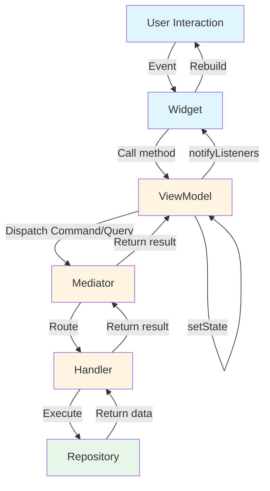

# UI Integration

This guide focuses on the Presentation layer—connecting business logic to Flutter widgets through ViewModels, reactive state management, and event handling. You'll learn how ViewModels transform domain data into UI-ready state by dispatching message objects, how to render asynchronous data with exhaustive `switch` expressions (and when to reach for AsyncBuilder instead), and how to handle one-time events like navigation or snackbars. By the end, you'll understand the unidirectional data flow pattern that makes UI complexity scale linearly with feature complexity rather than exponentially.

## The ViewModel Pattern

### Role and Responsibilities

In the Chassis architecture, ViewModels serve as the bridge between business logic and the widget tree, as explained in the layered architecture from [Core Architecture](01_core_architecture.md#layered-architecture). Their primary responsibility is state transformation—converting raw domain data into a format the UI can render directly without additional processing. Unlike traditional controllers that might manipulate widgets, ViewModels emit state changes and widgets rebuild reactively in response.

ViewModels manage three distinct concerns. First, they hold the current UI state and notify listeners when it changes through Flutter's ChangeNotifier mechanism. Second, they translate user actions into Commands or Queries and dispatch the message objects themselves through `run()`, `read()`, and `watch()`. Third, they emit events for one-time occurrences like showing snackbars or navigating, keeping these separate from persistent state.

```dart
class UserProfileState {
  const UserProfileState({
    required this.user,
    required this.isEditing,
  });

  final Async<User> user;
  final bool isEditing;

  UserProfileState copyWith({
    Async<User>? user,
    bool? isEditing,
  }) {
    return UserProfileState(
      user: user ?? this.user,
      isEditing: isEditing ?? this.isEditing,
    );
  }

  static UserProfileState initial() {
    return const UserProfileState(
      user: Async.loading(),
      isEditing: false,
    );
  }
}

sealed class UserProfileEvent {}

final class UserUpdatedEvent implements UserProfileEvent {
  const UserUpdatedEvent();
}

final class UserUpdateFailedEvent implements UserProfileEvent {
  const UserUpdateFailedEvent(this.error);

  /// The error object itself — never `error.toString()`, which would
  /// destroy pattern matching on domain error types.
  final Object error;
}

class UserProfileViewModel
    extends ViewModel<UserProfileState, UserProfileEvent> {
  UserProfileViewModel({super.mediator}) : super(UserProfileState.initial());

  // watch is keyed by the query's runtime type: calling loadUser again with
  // a new userId replaces the previous subscription instead of stacking a
  // second one. current carries the existing data through the loading
  // emission.
  void loadUser(String userId) => watch(
        WatchUserQuery(userId: userId),
        current: state.user,
        onState: (user) => setState(state.copyWith(user: user)),
      );

  // onSuccess/onError fire additively for their respective outcome.
  void updateEmail(String userId, String newEmail) => run(
        UpdateUserEmailCommand(userId: userId, newEmail: newEmail),
        onSuccess: (_) => sendEvent(const UserUpdatedEvent()),
        onError: (error, stack) => sendEvent(UserUpdateFailedEvent(error)),
      );

  void toggleEditMode() =>
      setState(state.copyWith(isEditing: !state.isEditing));
}
```

State immutability ensures predictable behavior. The `copyWith` pattern creates new state objects rather than mutating existing ones, which simplifies debugging and prevents subtle bugs from shared mutable state. Local UI state like `isEditing` lives in the ViewModel, while domain data like user profiles flows through the Mediator from handlers.

Notice what the ViewModel does *not* contain: a mediator field. `run()`, `read()`, and `watch()` dispatch the message through the mediator installed once at startup, before `runApp`:

```dart
void main() {
  Chassis.initialize(AppMediator(
    userRepository: FirebaseUserRepository(),
  ));
  runApp(const MyApp());
}
```

`AppMediator` is the generated mediator — a registration constructor that takes handler dependencies and wires every handler (see [Code Generation](03_code_generation.md)). ViewModels never reference it as a type: they dispatch message objects, and the installed mediator routes them. The constructor's `mediator:` parameter overrides the global one and is the testing seam — `UserProfileViewModel(mediator: fakeMediator)` — so tests never touch `Chassis.initialize`. Dispatching without either produces an actionable `StateError` telling you to initialize.

Notice also the shape of the methods: every ViewModel method is synchronous and expression-bodied. All asynchrony lives in the dispatch machinery — a ViewModel never awaits.

### Unidirectional Data Flow

Chassis enforces unidirectional data flow where user interactions flow upward as Commands or Queries, and data flows downward as state updates. This pattern prevents bidirectional dependencies that complicate debugging and testing. Widgets never call repositories directly, and repositories never know about ViewModels, creating a clean separation of concerns.



This pattern creates a predictable loop: interaction → command → handler → repository → state update → widget rebuild. Data flows in one direction, making it easy to trace how user actions affect state and how state changes trigger UI updates. If the UI displays incorrect data, you can trace backward through this flow—check the state, check ViewModel updates, check handler logic, check repository implementation.

Unlike traditional controllers that might manipulate widgets directly, a Chassis ViewModel relies exclusively on state mutation. When a user taps a button, the ViewModel does not modify the view directly. Instead, it dispatches a command through the Mediator and updates its internal state based on the result. The widget observes this state change and rebuilds accordingly.

### Platform Async Lives in the Widget

ViewModels are await-free, so where does platform asynchrony go — image pickers, permission requests, biometrics, share sheets? In the widget. The widget awaits the platform API, guards its `BuildContext` after the await (the `use_build_context_synchronously` lint enforces this), guards against double-taps, and then hands *plain data* to a synchronous ViewModel method:

```dart
class _ChangeAvatarButtonState extends State<ChangeAvatarButton> {
  bool _picking = false;

  Future<void> _pickAvatar() async {
    setState(() => _picking = true);
    try {
      final file = await ImagePicker().pickImage(source: ImageSource.gallery);
      // The widget resumed after an await: guard the context before using it.
      if (!context.mounted || file == null) return;
      context.read<UserProfileViewModel>().changeAvatar(file);
    } finally {
      if (mounted) setState(() => _picking = false);
    }
  }

  @override
  Widget build(BuildContext context) {
    return ElevatedButton(
      // Disabled while the picker is open: two concurrent pickImage calls
      // throw PlatformException(already_active).
      onPressed: _picking ? null : _pickAvatar,
      child: const Text('Change avatar'),
    );
  }
}
```

The ViewModel side stays synchronous — it receives the picked file as data and dispatches a command:

```dart
void changeAvatar(XFile file) => run(
      UpdateAvatarCommand(file.path),
      current: state.user,
      onState: (user) => setState(state.copyWith(user: user)),
    );
```

This split keeps responsibilities clean: the widget owns the platform conversation (which is inherently tied to UI lifecycle — a picker outliving its screen is a bug), and the ViewModel owns the business consequence. Business asynchrony — network, database — never surfaces in either: it lives in handlers, behind the dispatch.

### Dispatching Messages

ViewModels provide three dispatch methods, one per message kind: `run()` for a `Command`, `read()` for a `ReadQuery`, and `watch()` for a `WatchQuery`. Each takes the message object itself — not a closure, not a stream — plus callbacks that report the operation's lifecycle as `Async<T>` states. Handing the framework the message (rather than an already-started future) is what lets a `RunPolicy` debounce, drop, or queue the dispatch.

#### The watch() Method

The `watch()` method dispatches a `WatchQuery` and manages the resulting subscription, calling the provided callbacks as the stream emits. Subscription management happens automatically—the ViewModel cancels subscriptions when it disposes, preventing memory leaks. Use watch for data that changes over time, like todo lists, presence indicators, or collaborative document state.

```dart
class ExampleViewModel extends ViewModel<ExampleState, ExampleEvent> {
  // Using onState for full lifecycle control
  void watchUser(String userId) => watch(
        WatchUserQuery(userId: userId),
        current: state.user,
        onState: (user) => setState(state.copyWith(user: user)),
      );
}
```

Optional parameters shape the subscription's behavior:

- **`key:`** — defaults to the query's runtime type. A new `watch()` with the same key cancels and replaces the previous subscription, so re-watching the same query class with new arguments (calling `watchUser` with a new id above) swaps the subscription instead of stacking a second one. To watch several instances of the same query class concurrently, pass distinct explicit keys — e.g. `key: (WatchUserQuery, userId)` — which makes the watches additive. Additive subscriptions live until the ViewModel is disposed or the returned `WatchHandle` is cancelled.
- **`current:`** — the current `Async<T>` state, if any. The initial loading emission and error transitions carry its data, so a re-watch never blanks the UI.
- **`emitLoading:`** — whether to emit an `AsyncLoading` immediately on subscription (default `true`). Pass `false` when re-watching in the background and the UI should keep rendering the current data untouched until fresh data arrives.
- **`onDone:`** — invoked when the stream itself completes, never on cancellation (keyed replacement, `WatchHandle.cancel`, or disposal). Infinite streams (Firestore-style watchers) never trigger it; for finite streams it is the only signal that no further emissions will come — without it the state stays frozen on the last data. The subscription is released before `onDone` runs, so starting a replacement `watch()` under the same key from inside the callback is safe.

If the stream emits an error, `watch()` reports a *soft error*: the emitted `AsyncError` carries the last known data, keeping content on screen through transient stream failures. The `onError` callback receives `(Object error, StackTrace stack)`. The same protection covers dispatch itself: a handler that throws synchronously (a non-`async*` handler failing) reports a soft `AsyncError` through the callbacks and returns an already-cancelled handle — never a crash at the call site.

#### The run() and read() Methods

`run()` dispatches a `Command`; `read()` dispatches a `ReadQuery`. They are identical in every parameter and guarantee — use the one that matches the message kind. Both accept the same `current:` and `emitLoading:` parameters as `watch()` (`emitLoading: false` makes a background refresh silent until it completes) and return the final `Async<R>` state. For mutations whose outcome is known upfront, both also accept an `optimistic:` value (see [Optimistic Updates](#optimistic-updates)).

```dart
class ExampleViewModel extends ViewModel<ExampleState, ExampleEvent> {
  // read() for a one-time fetch; current carries data through a refetch,
  // and restartable lets a newer read supersede the in-flight one.
  void loadUser(String userId) => read(
        GetUserQuery(userId: userId),
        policy: const RunPolicy.restartable(),
        current: state.user,
        onState: (user) => setState(state.copyWith(user: user)),
      );

  // run() for a command; the failure event carries the error object.
  void deleteUser(String userId) => run(
        DeleteUserCommand(userId: userId),
        onSuccess: (_) => sendEvent(const UserDeletedEvent()),
        onError: (error, stack) => sendEvent(UserDeleteFailedEvent(error)),
      );
}
```

Any dispatch failure — a handler throwing synchronously or asynchronously, even a wiring error — is reported as an `AsyncError` through the same callbacks, never as an exception at the call site. Awaiting the returned `Future<Async<R>>` is therefore always safe: it never throws.

#### Concurrency: key and RunPolicy

Two overlapping `run()` calls writing to the same state field race: the last completion wins, and that may be the *oldest* dispatch (network timing is arbitrary). A `RunPolicy` decides who wins among runs sharing a key:

```dart
// Search field: latest wins, and bursts of keystrokes coalesce.
// The key defaults to SearchUsersQuery, so every dispatch of this
// query class shares the policy — no explicit key needed.
void search(String terms) => read(
      SearchUsersQuery(terms: terms),
      policy: const RunPolicy.restartable(debounce: Duration(milliseconds: 300)),
      current: state.results,
      onState: (results) => setState(state.copyWith(results: results)),
    );

// Submit button: first wins, a double-tap cannot dispatch twice.
void submitOrder() => run(
      SubmitOrderCommand(cart: state.cart),
      policy: const RunPolicy.droppable(),
      onSuccess: (_) => sendEvent(const OrderSubmittedEvent()),
      onError: (error, stack) => sendEvent(OrderFailedEvent(error)),
    );
```

A policy answers one question — when several runs collide on a key, who wins?

| Policy | Who wins | Typical use |
|--------|----------|-------------|
| `RunPolicy.concurrent()` (default) | Everyone — results may interleave | Independent operations that never write the same field |
| `RunPolicy.restartable({debounce})` | The latest — in-flight callbacks are invalidated; an optional `debounce` window coalesces bursts before dispatching | Refetches, search-as-you-type |
| `RunPolicy.droppable()` | The first — later calls don't dispatch and resolve with the in-flight result | Submit buttons, anything a double-tap must not repeat |
| `RunPolicy.sequential()` | Everyone, in call order (queued per key) | Ordered mutations |

The `key` defaults to the message's runtime type, so two dispatches of the same message class already interact under the same policy. Pass an explicit `key` to separate them (per-entity keys like `key: (SetFavoriteCommand, articleId)`) or to make *different* message types share a policy. All runs sharing a key must have the same result type — asserted in debug mode.

There is no separate "debounce" policy: debouncing alone would not fix result races (two dispatches separated by more than the window can still complete out of order), so the debounce window is a parameter of `restartable`. Superseded and dropped calls still resolve — with their own result (`restartable`) or the winner's (`droppable`, coalesced `debounce`) — so awaiting `run()` is always safe.

One caveat deserves emphasis: **`restartable` does not cancel the underlying execution** — only the superseded run's callbacks are cut. The superseded network call completes and its side effects land (a superseded POST still hits the server); it just stops reporting state. That makes `restartable` a fit for reads and idempotent refetches, not for mutations where a duplicate execution would be harmful — reach for `droppable` or `sequential` there. Note also that `sequential` captures `current:` when `run()` is *called*, not when the queued operation starts — prefer reading fresh state inside `onState`.

`watch()` gets the same protection from its `key`: a new watch on the same key (by default, the same query class) replaces the previous subscription.

#### Optimistic Updates

For mutations whose outcome is known upfront (toggle a favorite, check a task), `run()` accepts an `optimistic:` parameter. At dispatch, `onState` receives that `AsyncData` *instead of* a loading state — the field takes the expected value immediately. `onSuccess`/`onError` still fire only for the real result:

```dart
void toggleFavorite() {
  final article = state.article.requireValue;
  final toggled = article.copyWith(isFavorite: !article.isFavorite);
  run(
    SetFavoriteCommand(articleId: article.id, value: toggled.isFavorite),
    policy: const RunPolicy.droppable(),
    current: state.article,
    optimistic: AsyncData(toggled),
    onState: (article) => setState(state.copyWith(article: article)),
    onError: (error, stack) => sendEvent(FavoriteFailedEvent(error)),
  );
}
```

The encoding is honest: the field really *is* `AsyncData`, so the UI renders the value with zero optimism-specific code. If a screen must visually mark the value as "unconfirmed", that is not optimistic UI anymore — model the status in the domain (e.g. a `pending` flag on the entity) or use the normal loading pipeline.

On failure, the emitted `AsyncError.previous` is the last *confirmed* data — the latest completion of a run on the same `key`, or the data carried by `current:` at dispatch — never the optimistic value. Rendering `previous` on error (as usual) therefore rolls the UI back automatically. Pair with `RunPolicy.droppable()` — the key already defaults to the command's class — so a double-tap cannot dispatch the mutation twice.

Two boundaries:

- `optimistic:` is typed `AsyncData<R>?`, not `R?`: for a nullable `R`, `optimistic: AsyncData(null)` ("optimistically cleared") stays distinct from omitting the parameter.
- `watch()` has no `optimistic:` — the stream's next emission would immediately overwrite it. Optimism for watched data belongs in the repository: emit the patched value on the stream, reconcile when the server answers.

#### Callback Patterns

`run()`, `read()`, and `watch()` share one callback contract:

- `onState` (if provided) fires for **every** transition — loading, data, and error — with the corresponding `Async<T>` value.
- `onSuccess` (on `run`/`read`) / `onData` (on `watch`) and `onError` are **additive** conveniences, invoked *after* `onState` for their respective transition. Providing them never suppresses `onState`. They carry the same value — a `run` result is a *success*, a `watch` emission is *data* — a deliberate naming asymmetry.
- `onError` receives `(Object error, StackTrace stack)` everywhere.
- At least one callback must be provided.
- Callbacks run outside the framework's error handling: an exception thrown by your callback is a bug in the callback and propagates as such — it is never converted into an `AsyncError`.

One rule dominates the rest: **the error path must always be covered**. Every `run()`/`read()` call needs `onState` (which receives error transitions) or `onError`. `onSuccess` alone compiles, but a failure then evaporates — no state transition consumed, no event fired:

```dart
// ❌ The "invisible failure" anti-pattern: a failed creation is silent.
run(
  CreateUserCommand(name: name, email: email),
  onSuccess: (user) => sendEvent(UserCreatedEvent(user)),
);
```

Choose the combination that matches the call site:

**onState** — full lifecycle control with `Async<T>`, error path included:
```dart
read(
  GetUserQuery(userId: userId),
  current: state.user,
  onState: (user) => setState(state.copyWith(user: user)),
);
```

Use `onState` when the state should reflect the complete async lifecycle — loading indicators, previous data during refetches, rendered errors.

**onSuccess + onError** — outcome callbacks with unwrapped values:
```dart
run(
  CreateUserCommand(name: name, email: email),
  onSuccess: (user) => sendEvent(UserCreatedEvent(user)),
  onError: (error, stack) => sendEvent(UserCreationFailedEvent(error)),
);
```

Use this pair for fire-and-forget commands whose outcome maps to events rather than state. The failure event carries the error *object* — handing `error.toString()` to an event would destroy pattern matching downstream.

**All three** — mirror the lifecycle in state while dispatching one-time events on the outcome:
```dart
run(
  DeleteUserCommand(userId: userId),
  current: state.user,
  onState: (user) => setState(state.copyWith(user: user)),
  onSuccess: (_) => sendEvent(const UserDeletedEvent()),
  onError: (error, stack) => sendEvent(UserDeleteFailedEvent(error)),
);
```

Because the callbacks are additive, combining them costs nothing: `onState` keeps the rendering truthful, `onSuccess`/`onError` trigger the side effects.

#### Resource Lifecycle Helpers

Beyond the dispatch methods, the `BaseUtils` extension ties arbitrary resources to the ViewModel's lifecycle, so cleanup lives on the line that creates the resource instead of accumulating in `dispose()`:

```dart
class ExampleViewModel extends ViewModel<ExampleState, ExampleEvent> {
  ExampleViewModel(TextEditingController controller, {super.mediator})
      : super(ExampleState.initial()) {
    // Removes the listener automatically on dispose.
    listenTo(controller, _onTextChanged);

    // Listens to several Listenables as one; same automatic cleanup.
    mergeAndListenTo([controllerA, controllerB], _recompute);

    // Disposes any Disposable / cancels a raw subscription on dispose.
    autoDispose(someDisposable);
    autoDisposeStreamSubscription(someStream.listen(_onData));
  }
}
```

## Modeling State with Async<T>

### The Async<T> Type

Async<T> is a sealed class representing the complete lifecycle of an asynchronous operation, ensuring UI handles all possibilities—loading, success, and error. This eliminates bugs where loading states are forgotten or error conditions go unhandled. The sealed class guarantees exhaustive pattern matching, where Dart's type system requires handling all three cases.

```dart
sealed class Async<T> {
  const Async();

  T? get valueOrNull;
  Object? get errorOrNull;
  bool get isLoading;
  bool get hasValue;
  bool get hasError;
  T get requireValue;
  AsyncData<T>? get maybeDataOrPrevious;

  // Factories
  const factory Async.data(T value) = AsyncData<T>;
  const factory Async.loading({AsyncData<T>? previous}) = AsyncLoading<T>;
  const factory Async.error(Object error,
      {StackTrace? stackTrace, AsyncData<T>? previous}) = AsyncError<T>;
}

class AsyncData<T> extends Async<T> {
  const AsyncData(this.value);
  final T value;
}

class AsyncLoading<T> extends Async<T> {
  const AsyncLoading({this.previous});
  final AsyncData<T>? previous;  // Last successful state, for anti-flickering
}

class AsyncError<T> extends Async<T> {
  const AsyncError(this.error, {this.stackTrace, this.previous});
  final Object error;
  final StackTrace? stackTrace;
  final AsyncData<T>? previous;  // Last successful state, for soft errors
}
```

AsyncLoading and AsyncError can optionally retain the previous successful state, enabling the UI to show stale data during refetches or display previous values alongside error messages. This anti-flickering capability improves user experience significantly, as discussed in the rendering section below.

Note that `previous` is a full `AsyncData<T>`, not a bare `T?`. Carrying the whole state makes "a value existed" provable by the type system even when `T` is nullable and the value itself is `null`: `Async<int?>.data(null)` has `hasValue == true`. For the same reason, prefer `hasValue` (or pattern matching) over null-checking `valueOrNull` when `T` is nullable — and never collapse the error path with `valueOrNull ?? fallback`, which renders a failure as if it were data. All variants implement `==` and `hashCode`, so state comparisons behave as expected.

### Pattern Matching

Dart 3's pattern matching makes working with Async<T> concise and type-safe. The sealed class ensures exhaustive checking—the compiler requires handling all three cases when switching on Async<T> values.

```dart
// In ViewModel — onState with pattern matching for per-transition effects
void loadUser(String userId) => read(
      GetUserQuery(userId: userId),
      onState: (asyncUser) {
        setState(state.copyWith(user: asyncUser));
        switch (asyncUser) {
          case AsyncData(:final value):
            sendEvent(UserLoadedEvent(value));
          case AsyncError(:final error):
            sendEvent(UserLoadFailedEvent(error));
          case AsyncLoading():
            break;
        }
      },
    );

// Or using additive onSuccess/onError for cleaner code
void loadUser(String userId) => read(
      GetUserQuery(userId: userId),
      onState: (user) => setState(state.copyWith(user: user)),
      onSuccess: (user) => sendEvent(UserLoadedEvent(user)),
      onError: (error, stack) => sendEvent(UserLoadFailedEvent(error)),
    );

// Or using if-case for specific scenarios
if (asyncUser case AsyncData(:final value)) {
  // Guaranteed non-null value in this scope
  print('User name: ${value.name}');
}
```

Pattern matching extracts values safely. The compiler guarantees that `value` is non-null within the `AsyncData` case, eliminating defensive null checks. This type safety prevents runtime errors and makes code more maintainable.

### Fluent State Transitions

Async<T> provides fluent methods for common state transitions, simplifying how ViewModels update state as operations progress through their lifecycle.

```dart
// Transition to loading while keeping current data (refetch)
final refetching = currentState.toLoading();  // AsyncLoading(previous: currentData)

// Transition to data (success)
final success = currentState.toData(newUser);  // AsyncData(newUser)

// Transition to error while keeping current data (soft error)
final softError = currentState.toError(exception, stackTrace);  // AsyncError(..., previous: currentData)
```

These methods preserve previous data when appropriate, enabling the UI to maintain display during refetches or show stale data with error overlays. In practice you rarely call them yourself: passing `current:` to `run()`, `read()`, or `watch()` produces these carrying states for you.

### Combinators: when() and map()

Beyond pattern matching, `Async<T>` ships two combinators for the everyday transformations:

`when()` folds the state into a single value, exhaustively — the expression-friendly alternative to a `switch` when you produce a value rather than a widget branch. `data` receives only fresh values (`AsyncData`); a value merely *carried* by a loading or error state does not count as data here — read `valueOrNull` inside `loading`/`error` if you want it:

```dart
final label = state.user.when(
  data: (user) => user.name,
  loading: () => 'Loading…',
  error: (e, _) => 'Failed: $e',
);
```

`map()` transforms the value while preserving the state — loading stays loading, an error keeps its error and stack trace, and any carried `previous` data is transformed too. This is the right tool for deriving a projection of a larger async state without re-implementing the three-way branching:

```dart
// Async<User> → Async<String>, preserving loading/error/previous.
final Async<String> name = state.user.map((user) => user.name);
```

Also worth knowing: `hasValue` (true when a value exists, fresh or carried — correct even for nullable `T`), `valueOrNull`, `requireValue` (throws with an actionable message when no value exists), and `maybeDataOrPrevious` (the last confirmed `AsyncData<T>` — the state itself if it is data, otherwise the carried `previous`, or `null`; unlike `valueOrNull`, the wrapper stays unambiguous for nullable `T`).

## Rendering Async State

### The Default: an Inline switch Expression

Because `Async<T>` is sealed, a `switch` expression over it is checked for exhaustiveness: the compiler forces the widget to handle `AsyncLoading`, `AsyncError`, and `AsyncData`, and destructuring extracts the payload on the same line. For simple rendering — spinner while loading, error panel on failure, content on data — this is the preferred style: three cases in plain sight, no builder indirection.

```dart
class UserProfileScreen extends StatelessWidget {
  const UserProfileScreen({super.key});

  @override
  Widget build(BuildContext context) {
    // select subscribes this widget to just the field it renders:
    // unrelated state changes don't trigger a rebuild.
    final asyncUser = context.select(
      (UserProfileViewModel vm) => vm.state.user,
    );

    return Scaffold(
      appBar: AppBar(title: const Text('User Profile')),
      body: switch (asyncUser) {
        AsyncLoading() => const Center(child: CircularProgressIndicator()),
        AsyncError(:final error) => Center(
            child: Column(
              mainAxisAlignment: MainAxisAlignment.center,
              children: [
                const Icon(Icons.error, size: 48, color: Colors.red),
                const SizedBox(height: 16),
                Text('Error loading profile: $error'),
                ElevatedButton(
                  // read (not watch/select) inside callbacks: no subscription
                  onPressed: () =>
                      context.read<UserProfileViewModel>().loadUser('userId'),
                  child: const Text('Retry'),
                ),
              ],
            ),
          ),
        AsyncData(value: final user) => Column(
            children: [
              CircleAvatar(
                backgroundImage: NetworkImage(user.avatarUrl),
                radius: 50,
              ),
              const SizedBox(height: 16),
              Text(user.name, style: Theme.of(context).textTheme.headlineMedium),
              Text(user.email),
              const SizedBox(height: 24),
              Text('Member since ${user.createdAt.year}'),
            ],
          ),
      },
    );
  }
}
```

Guarded cases compose naturally — `AsyncData(value: final todos) when todos.isEmpty => const EmptyState()` slots in as a fourth branch without breaking exhaustiveness.

Note the three access patterns at work, each with its own job:

- `context.select((UserProfileViewModel vm) => vm.state.user)` in `build` — subscribes the widget to exactly the field it renders, with the ViewModel type inferred from the closure parameter. This is the default for reading state.
- `context.read<UserProfileViewModel>()` in callbacks — calls a method without creating a subscription.
- `context.watch<UserProfileViewModel>()` — rebuilds on *every* state change; reserve it for a widget that genuinely consumes the whole state.

### The AsyncBuilder Widget

The inline switch has one blind spot: it renders each state *literally*. During a refetch the field is `AsyncLoading` — even when it carries the previous data — so the switch above flashes a spinner over content the user was just reading. When you want anti-flickering behavior (or reusable loading/error scaffolding), reach for `AsyncBuilder`:

```dart
AsyncBuilder<User>(
  state: context.select((UserProfileViewModel vm) => vm.state.user),
  builder: (context, user) {
    // Receives the unwrapped User — no null checks needed.
    return UserCard(user: user);
  },
  loadingBuilder: (context) => const Center(child: CircularProgressIndicator()),
  errorBuilder: (context, error) => ErrorPanel(error: error),
)
```

The `builder` callback receives the unwrapped value; `AsyncBuilder` only calls it when data is available. If `errorBuilder` is omitted, an error renders a standard `ErrorWidget` in debug builds — a silent default would hide failures during development — and nothing (`SizedBox.shrink`) in release builds, so always provide one for production surfaces.

### Anti-Flickering with maintainState

The `maintainState` parameter, which defaults to `true`, is the reason AsyncBuilder exists: it prevents flickering during refetches by showing previous data during loading states instead of the loading widget. This creates a much smoother user experience, especially for pull-to-refresh scenarios.

```dart
AsyncBuilder<User>(
  state: context.select((UserProfileViewModel vm) => vm.state.user),
  maintainState: true,  // Default behavior
  builder: (context, user) {
    // Shows previous user data during refetch
    return UserCard(user: user);
  },
  loadingBuilder: (context) {
    // Only shown on INITIAL load when no data exists
    return const CircularProgressIndicator();
  },
)
```

Consider the visual flow through different states. On initial load with `Async.loading()` and no previous data, the `loadingBuilder` renders showing a spinner. After first load with `Async.data(user)`, the `builder` renders displaying the user profile. On refetch with `AsyncLoading(previous: AsyncData(user))`, the `builder` continues rendering with previous user data—no flicker to loading state. When refetch completes with `Async.data(newUser)`, the `builder` renders with updated user data, smoothly transitioning from old to new. The same holds for soft errors: an `AsyncError` carrying previous data keeps rendering the data.

Producing the carrying states is the framework's job, not yours: pass `current: state.user` to `run()`, `read()`, or `watch()` and the loading and error emissions automatically carry the existing data (equivalent to calling `state.user.toLoading()` yourself).

This pattern is ideal for pull-to-refresh scenarios where showing stale data during refresh provides better UX than a loading spinner. Users see their data immediately and can continue interacting while fresh data loads in the background. When fresh data arrives, the UI updates smoothly without jarring transitions.

## Handling One-Time Events

### State vs Events

A fundamental architectural distinction in Chassis is between persistent state and ephemeral events. State represents data that determines what the UI renders at any moment—user profiles, form field values, lists of items, loading indicators. If the user rotates their device or navigates away and back, this state should persist and restore the same display.

Events represent one-time occurrences that should not be replayed if the UI rebuilds. They trigger side effects like navigation, snackbars, dialogs, or vibrations. A "User created successfully" event shows a snackbar once, not every time the widget rebuilds. A "Payment failed" event shows an error dialog once. A "Login succeeded" event navigates to the home screen once.

```dart
// State - Persistent
class CheckoutState {
  const CheckoutState({
    required this.cart,
    required this.shippingAddress,
    required this.isProcessingPayment,
  });

  final Async<List<CartItem>> cart;
  final Address? shippingAddress;
  final bool isProcessingPayment;
}

// Events - Ephemeral
sealed class CheckoutEvent {}

final class PaymentSuccessEvent implements CheckoutEvent {
  const PaymentSuccessEvent(this.orderId);
  final String orderId;
}

final class PaymentFailedEvent implements CheckoutEvent {
  const PaymentFailedEvent(this.error);

  // The error object, so the listener can pattern match on domain error
  // types. Never carry error.toString() in an event.
  final Object error;
}

final class NavigateToOrderConfirmationEvent implements CheckoutEvent {
  const NavigateToOrderConfirmationEvent(this.orderId);
  final String orderId;
}
```

State determines what appears on screen right now. Events describe what should happen once in response to an action. This separation prevents bugs where snackbars show repeatedly or navigation happens multiple times due to widget rebuilds.

Note the shape of `PaymentFailedEvent`: it carries the error *object* — the domain error from the handler, or a dedicated type. A ViewModel that stringifies the error at emission (`sendEvent(PaymentFailedEvent(error.toString()))`) destroys the listener's ability to branch on error types; formatting user-facing copy is the listener's job, done at the last moment.

### Listening to Events

`ViewModelProvider.withEventListener` is the preferred way to listen to a ViewModel's events. It creates the ViewModel, subscribes to its event stream, and invokes your callback for each emitted event — all in one place, with automatic subscription cleanup tied to the provider's lifetime.

```dart
ViewModelProvider.withEventListener<CheckoutViewModel, CheckoutEvent>(
  // Dispatches through the mediator installed by Chassis.initialize.
  create: (_) => CheckoutViewModel(),
  onEvent: (context, viewModel, event) {
    switch (event) {
      case PaymentSuccessEvent(:final orderId):
        ScaffoldMessenger.of(context).showSnackBar(
          SnackBar(content: Text('Payment successful! Order #$orderId')),
        );

      case PaymentFailedEvent(:final error):
        showDialog(
          context: context,
          builder: (context) => AlertDialog(
            title: const Text('Payment Failed'),
            // Map the error object to user-facing copy at the last moment,
            // e.g. by switching on your domain error types.
            content: Text(error.toString()),
            actions: [
              TextButton(
                onPressed: () => Navigator.pop(context),
                child: const Text('OK'),
              ),
            ],
          ),
        );

      case NavigateToOrderConfirmationEvent(:final orderId):
        Navigator.pushReplacement(
          context,
          MaterialPageRoute(
            builder: (context) => OrderConfirmationScreen(orderId: orderId),
          ),
        );
    }
  },
  child: const CheckoutScreen(),
);
```

The `context` passed to `onEvent` is the provider's own context — above the ViewModel it creates — so `ScaffoldMessenger.of(context)` and `Navigator.of(context)` work, but `context.read<CheckoutViewModel>()` does not. Use the `viewModel` callback argument when you need the VM itself. Pattern matching on sealed event types ensures exhaustive handling: the compiler requires handling all event types defined in the sealed hierarchy.

Note that `.withEventListener` creates the ViewModel eagerly (unlike the default constructor which is lazy), so events emitted during construction are not missed.

#### EventListener for descendant listeners

When a widget deep in the subtree needs to listen to a ViewModel provided by an ancestor, wrap it in an `EventListener` — the event-side counterpart of `AsyncBuilder`. Its callback context sits *below* the provider, so `context.read<CheckoutViewModel>()` works there, and it resubscribes automatically if the provider swaps its ViewModel instance.

```dart
EventListener<CheckoutViewModel, CheckoutEvent>(
  onEvent: (context, event) {
    if (event is PaymentSuccessEvent) {
      // React locally to an ancestor-provided VM's events.
    }
  },
  child: const CartSummary(),
);
```

#### EventListenerMixin for stateful descendants

`EventListenerMixin` serves widgets that are already `StatefulWidget`s and would rather not wrap their tree, or whose handler needs local `State` fields (controllers, focus nodes, scroll positions). It handles subscription lifecycle through `initState` and `dispose`.

```dart
class _CartSummaryState extends State<CartSummary> with EventListenerMixin {
  @override
  void initState() {
    super.initState();
    onEvent<CheckoutViewModel, CheckoutEvent>((event) {
      if (event is PaymentSuccessEvent) {
        // React locally to an ancestor-provided VM's events.
      }
    });
  }

  @override
  Widget build(BuildContext context) => const SizedBox();
}
```

### Why Not Put Events in State?

A common mistake is modeling events as nullable state properties, such as `String? snackbarMessage` in the state class. This approach causes several problems that become apparent as applications grow. Rebuilds replay events—if the widget rebuilds for unrelated reasons, the snackbar shows again. Manual cleanup becomes required, forcing you to null out the property after consuming it, creating imperative update patterns that complicate state management. State pollution occurs as ephemeral data clutters the state object with fields that don't represent persistent UI state.

```dart
// ❌ Don't do this
class BadState {
  final String? snackbarMessage;  // Will replay on every rebuild
  final String? navigationRoute;  // Causes navigation loops

  BadState({this.snackbarMessage, this.navigationRoute});
}

// After showing snackbar, must manually clear it
void onSnackbarShown() {
  viewModel.setState(state.copyWith(snackbarMessage: null));
}

// ✅ Do this
sealed class GoodEvent {}

final class ShowSnackbarEvent implements GoodEvent {
  const ShowSnackbarEvent(this.message);
  final String message;
}

// Events fire once per occurrence, regardless of rebuilds
void onSaveSucceeded() {
  viewModel.sendEvent(ShowSnackbarEvent('Success!'));
}
```

Events solve these problems by firing once per occurrence, regardless of rebuilds. No manual cleanup is required—events are delivered through a stream that widgets subscribe to independently of the widget rebuild cycle. This architectural separation keeps state clean and focused on what should appear on screen, while events handle what should happen once.

## Widget Testing

### Testing with a Fake ViewModel

Widget tests verify UI rendering and user interaction handling without executing business logic, isolating the UI layer from domain concerns. Substitute the ViewModel to control state and observe method calls — no mocking library required. Two seams work:

1. **A hand-written fake subclass** of the real ViewModel — pin state exactly, override action methods to record calls. Because the fake *is* a real `ViewModel`, it keeps the ChangeNotifier machinery and the `events` stream the provider relies on. (This is why mockito/mocktail-style mocks of a ViewModel are a trap: the provider calls `addListener` at mount, and a mock has no real implementation behind it.)
2. **The real ViewModel with a fake mediator** — `UserProfileViewModel(mediator: fakeMediator)` exercises the real dispatch pipeline against fake handlers. Never call `Chassis.initialize` in tests; the constructor parameter is the seam, and it always wins over the global.

Either way, provide the instance with `ViewModelProvider<T>.value` — **never** `Provider<T>.value`. A ViewModel *is* a `Listenable`, and provider's `debugCheckInvalidValueType` throws at `pumpWidget` when a plain `Provider` receives one (that check exists precisely to force a listening provider, which is what `ViewModelProvider` is). Since `.value` never disposes the instance, the test owns its lifecycle — dispose it in a teardown.

```dart
// test/widgets/user_profile_screen_test.dart
import 'package:chassis_flutter/chassis_flutter.dart';
import 'package:flutter/material.dart';
import 'package:flutter_test/flutter_test.dart';

class FakeUserProfileViewModel extends UserProfileViewModel {
  // setState is @protected: a subclass may call it to seed any state.
  FakeUserProfileViewModel(UserProfileState initial) {
    setState(initial);
  }

  final List<({String userId, String newEmail})> updateEmailCalls = [];

  @override
  void loadUser(String userId) {}

  @override
  void updateEmail(String userId, String newEmail) =>
      updateEmailCalls.add((userId: userId, newEmail: newEmail));
}

Widget wrap(UserProfileViewModel viewModel) => MaterialApp(
      home: ViewModelProvider<UserProfileViewModel>.value(
        value: viewModel,
        child: const UserProfileScreen(),
      ),
    );

final alice = User(
  id: 'user123',
  name: 'Alice Johnson',
  email: 'alice@example.com',
  avatarUrl: 'https://example.com/avatar.jpg',
  createdAt: DateTime(2020, 1, 1),
);

void main() {
  testWidgets('displays user data when loaded', (tester) async {
    // Arrange
    final viewModel = FakeUserProfileViewModel(
      UserProfileState(user: Async.data(alice), isEditing: false),
    );
    addTearDown(viewModel.dispose);

    // Act
    await tester.pumpWidget(wrap(viewModel));

    // Assert
    expect(find.text('Alice Johnson'), findsOneWidget);
    expect(find.text('alice@example.com'), findsOneWidget);
    expect(find.text('Member since 2020'), findsOneWidget);
  });

  testWidgets('shows loading indicator on initial load', (tester) async {
    // Arrange — no previous data
    final viewModel = FakeUserProfileViewModel(
      const UserProfileState(user: Async.loading(), isEditing: false),
    );
    addTearDown(viewModel.dispose);

    // Act
    await tester.pumpWidget(wrap(viewModel));

    // Assert
    expect(find.byType(CircularProgressIndicator), findsOneWidget);
  });

  testWidgets('calls updateEmail when save button tapped', (tester) async {
    // Arrange
    final viewModel = FakeUserProfileViewModel(
      UserProfileState(user: Async.data(alice), isEditing: true),
    );
    addTearDown(viewModel.dispose);

    // Act
    await tester.pumpWidget(wrap(viewModel));
    await tester.enterText(find.byType(TextField), 'newemail@example.com');
    await tester.tap(find.text('Save'));

    // Assert
    expect(
      viewModel.updateEmailCalls,
      [(userId: 'user123', newEmail: 'newemail@example.com')],
    );
  });
}
```

The fake isolates UI tests from business logic: the state you seed drives rendering scenarios (loading, success, error), and the recorded calls assert that widgets dispatch the correct operations in response to user interactions — all with plain Dart, readable at a glance.

When a test should cover the real dispatch pipeline — policy behavior, `Async` transitions, callback wiring — use the second seam instead: a real ViewModel with a fake mediator carrying fake handlers.

```dart
class FakeWatchUserHandler implements WatchHandler<WatchUserQuery, User> {
  @override
  Stream<User> watch(WatchUserQuery query) => Stream.value(alice);
}
```

```dart
testWidgets('renders the user loaded through the real pipeline',
    (tester) async {
  final fakeMediator = Mediator()
    ..registerQueryHandler(FakeWatchUserHandler());

  final viewModel = UserProfileViewModel(mediator: fakeMediator)
    ..loadUser('user123');
  addTearDown(viewModel.dispose);

  await tester.pumpWidget(wrap(viewModel));
  await tester.pump(); // let the watched stream emit

  expect(find.text('Alice Johnson'), findsOneWidget);
});
```

### Testing Event Handling

Testing event-driven side effects requires making the ViewModel emit an event on demand. `sendEvent` is `@protected`, so a fake subclass can re-expose it — no stream controller plumbing needed, since a real ViewModel already owns a working `events` stream:

```dart
class FakeCheckoutViewModel extends CheckoutViewModel {
  void emit(CheckoutEvent event) => sendEvent(event);
}
```

```dart
testWidgets('shows snackbar on PaymentSuccessEvent', (tester) async {
  // Arrange
  final viewModel = FakeCheckoutViewModel();

  // Act
  await tester.pumpWidget(
    MaterialApp(
      home: ViewModelProvider.withEventListener<CheckoutViewModel,
          CheckoutEvent>(
        create: (_) => viewModel,
        // Mirror the production onEvent, or reuse a shared function.
        onEvent: (context, viewModel, event) {
          switch (event) {
            case PaymentSuccessEvent(:final orderId):
              ScaffoldMessenger.of(context).showSnackBar(
                SnackBar(content: Text('Payment successful! Order #$orderId')),
              );
            default:
              break;
          }
        },
        child: const CheckoutScreen(),
      ),
    ),
  );

  // Emit event
  viewModel.emit(const PaymentSuccessEvent('order123'));
  await tester.pump(); // Process event

  // Assert
  expect(find.text('Payment successful! Order #order123'), findsOneWidget);
  expect(find.byType(SnackBar), findsOneWidget);
});
```

Note that `.withEventListener` owns the VM's lifecycle and disposes it with the widget tree — a real ViewModel subclass handles that without any stubbing (another reason fakes beat mocks here). When the widget tree separates the provider from the listener, test the listener directly by providing the fake through `ViewModelProvider<CheckoutViewModel>.value` — which never disposes, so the test keeps ownership — and pumping the `EventListener` (or the `EventListenerMixin` widget) beneath it. For purely unit-level coverage of event handling logic, extract the `onEvent` callback into a top-level function and test it without any widget tree at all.

For testing business logic independently of the UI, see [Business Logic](02_business_logic.md#testing-strategy).

## Summary

The ViewModel pattern bridges business logic and UI through state transformation and message dispatch, following the unidirectional data flow illustrated in this guide: synchronous, expression-bodied methods hand `Command`, `ReadQuery`, and `WatchQuery` objects to `run()`, `read()`, and `watch()`, which report each operation's lifecycle as `Async<T>` states — with the error path always covered. Platform asynchrony stays in the widget, which awaits, guards its context, and passes plain data down. Async<T> models the complete lifecycle of asynchronous operations with exhaustive pattern matching; an inline `switch` expression renders it for simple cases, while AsyncBuilder adds anti-flickering through `maintainState`. Events handle one-time occurrences separately from persistent state — carrying error objects, never strings — consumed through `ViewModelProvider.withEventListener`, the `EventListener` widget, or `EventListenerMixin`.

This presentation layer integrates seamlessly with the business logic layer explored in [Business Logic](02_business_logic.md) and the architectural foundations from [Core Architecture](01_core_architecture.md). With these patterns, you can build Flutter applications where UI complexity scales linearly with feature complexity, not exponentially. The framework enforces patterns that prevent common mistakes while remaining flexible enough to handle sophisticated requirements.
