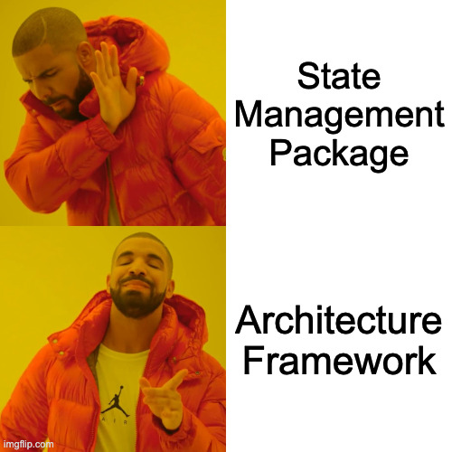

# Chassis 🏎️

An opinionated architecture framework for Flutter.

<p align="left">
  
</p>

Chassis provides a rigid structure for your apps so you can stop worrying about architecture and focus on writing code that matters. Because this structure is enforced by the framework rather than by convention, it prevents architectural drift as your codebase grows, without relying on developer discipline.

Chassis is built for the AI era. Its strictness naturally acts as rails for coding agents, and it ships with ready-to-use [AI skills](#built-for-the-ai-era).

## Overview

Chassis combines MVVM, command-query separation, and the mediator pattern. It consists of three packages:

* **[chassis](https://pub.dev/packages/chassis)** — pure Dart primitives: commands, queries, handlers, and the mediator
* **[chassis_flutter](https://pub.dev/packages/chassis_flutter)** — a powerful ViewModel class and reactive widgets to connect your business logic to the widget tree
* **[chassis_builder](https://pub.dev/packages/chassis_builder)** — generates the app mediator and verifies at build time that every message has a handler

New here? Start with the **[Quick Start](00_quick_start.md)** — a complete todo app in 15 minutes. Then dive into the guides:

* **[Core Architecture](01_core_architecture.md)** — the layers, command-query separation, and the mediator pattern
* **[Business Logic](02_business_logic.md)** — messages and handlers: validation, orchestration, and testing in isolation
* **[Code Generation](03_code_generation.md)** — `@chassisHandler`, `@ChassisApp`, modules, and the generator's build-time guarantees
* **[UI Integration](04_ui_integration.md)** — ViewModels, dispatching messages, rendering `Async<T>`, and one-time events
* **[Hard Cases](05_hard_cases.md)** — optimistic UI, deduplicating watch subscriptions, paginated lists, and what `restartable` does not do
* **[What a Feature Costs](06_feature_costs.md)** — an honest artifact-count comparison with Bloc and Riverpod, and what the ceremony buys
* **[Error Management](error_management.md)** — the error strategy end-to-end, from infrastructure to the UI
* **[Coding Rules](coding_rules.md)** — the framework's implementation rules in DO/DON'T form

## How is this different from Bloc or Riverpod?

Ask any Flutter stack one question: **where does business logic live?**

**Bloc** is opinionated about presentation — events in, states out — and its official answer is that business logic lives *inside* blocs. In practice, one class holds both your use cases and your UI state machine: logic gets tangled with presentation, reusing it across blocs is awkward, and some of it inevitably drifts into repositories.

**Riverpod** gives you a reactive dependency graph, deliberately unopinionated about layers: any provider can depend on any other, and layering is entirely up to your team's discipline.

**Chassis** implements [Flutter's recommended app architecture](https://docs.flutter.dev/app-architecture) — MVVM, commands, repositories. Business logic is a layer of its own. You describe each operation as a typed message — `CreateUserCommand`, `WatchCartQuery` — and write its logic in a *handler*, a plain class that receives the message and works with your repositories. ViewModels never touch a repository: they dispatch messages and hold UI state, nothing else. Every feature has the same three parts — a message, a handler, a ViewModel — so any piece of code has one obvious place to live, and the build fails when the structure is broken: a message without a handler is a build error, and so is a handler that tries to reach back into the mediator.

## See it in action

<table>
  <tr>
    <td align="center" width="50%">
      <!-- <br> -->
      <strong>Pulse</strong> — <em>coming soon</em><br>
      A real-time activity feed demonstrating <code>WatchQuery</code> streams and <code>RunPolicy</code> concurrency.
    </td>
    <td align="center" width="50%">
      <!-- <br> -->
      <strong>Ledger</strong> — <em>coming soon</em><br>
      An expense tracker demonstrating <code>@chassisModule</code> and the multi-package split.
    </td>
  </tr>
</table>

## Chassis at a glance

Chassis embraces architectural purity. It does require more boilerplate than most state management packages. But you aren't supposed to write this boilerplate by hand. Modern LLMs will generate it effortlessly.

Business logic is written as command and query handlers. Commands and queries are pure Dart objects dispatched by the UI: they carry the parameters the handler needs to apply your business logic.

```dart
final class CreateUserCommand extends Command<User> {
  CreateUserCommand({required this.name, required this.email});

  final String name;
  final String email;
}

@chassisHandler
class CreateUserHandler implements CommandHandler<CreateUserCommand, User> {
  CreateUserHandler(this._repository);

  final UserRepository _repository;

  // Trivial here — a real handler might validate input, coordinate
  // several repositories, or enforce business rules.
  @override
  Future<User> run(CreateUserCommand command) =>
      _repository.create(command.name, command.email);
}
```

`@chassisHandler` registers the handler in a generated mediator: a single interception point for middlewares like logging and crash reporting. The generator also verifies the wiring — a command or query with no handler fails the build at its declaration site, so an unhandled message can never reach runtime.

On the UI side, a `ViewModel` holds an immutable state, dispatches command and query objects through the mediator installed once in `main()` with `Chassis.initialize(AppMediator(...))`, and offers an event channel for one-time notifications like snackbars and navigation. ViewModels depend only on the message types, never on the generated mediator class. Asynchronous state fields are typed `Async<T>`, a sealed type covering loading, data, and error:

```dart
class UserViewModel extends ViewModel<UserState, UserEvent> {
  UserViewModel({super.mediator}) : super(const UserState());

  void createUser(String name, String email) => run(
        CreateUserCommand(name: name, email: email),
        onState: (user) => setState(state.copyWith(user: user)),
        onSuccess: (_) => sendEvent(UserCreatedEvent()),
      );
}
```

`run` reports the whole lifecycle as `Async<T>` states, so there are no hand-written `isLoading` flags or try/catch blocks — and no forgotten error path: `onState` fires for every transition (loading, data, error), while `onSuccess` and `onError(error, stack)` are additive conveniences on top of it. `read` and `watch` offer the same contract for one-shot and reactive queries, and a `RunPolicy` decides how concurrent dispatches interact (debounced, restartable, etc).

In the widget tree, `context.select` subscribes the widget to exactly the field it renders, and since `Async<T>` is sealed, a `switch` expression covers every state with compiler-checked exhaustiveness. Chassis also provides various widgets for more complex scenarios.

```dart
Widget build(BuildContext context) {
  final user = context.select((UserViewModel vm) => vm.state.user);
  return switch (user) {
    AsyncLoading() => const CircularProgressIndicator(),
    AsyncError(:final error) => Text('Error: $error'),
    AsyncData(value: final user?) => Text('Created ${user.name}'),
    AsyncData() => const Text('No user yet'),
  };
}
```

The **[Quick Start](00_quick_start.md)** walks through the rest: installation, queries, generating the mediator, and reacting to ViewModel events.

## Built for the AI era

AI agents work better when code is structured into small, modular pieces with single responsibilities. Chassis enforces this structure: there is only one correct way to add a feature, and the framework is designed to keep responsibilities from leaking across layers.

Adding a feature always touches the same files in the same order: a command, a handler, a ViewModel method. Agents produce small, predictable diffs — and so do humans.

The framework ships with ready-to-use AI skills to guide agents when working with Chassis:

* **chassis-create-command** — write operations as a `Command` + `CommandHandler` pair
* **chassis-create-read-query** — one-time fetches as a `ReadQuery` + `ReadHandler` pair
* **chassis-create-watch-query** — reactive subscriptions as a `WatchQuery` + `WatchHandler` pair
* **chassis-register-handler-with-codegen** — `@chassisHandler` registration, plus every build error the generator can raise
* **chassis-create-view-model** — designing `ViewModel<State, Event>`: state, events, `run` and `watch`
* **chassis-consume-view-model** — providing and reading ViewModels: `ViewModelProvider`, `context.select`
* **chassis-render-async-state** — rendering `Async<T>`, including anti-flicker with `AsyncBuilder`
* **chassis-handle-view-model-events** — one-time UI side effects: snackbars, navigation, dialogs
* **chassis-handle-errors** — the error strategy end-to-end, from repositories to the UI
* **chassis-organize-feature** — file layout, modules, and the multi-package split
* **chassis-bootstrap-app** — wiring the composition root: `@ChassisApp`, mediator construction, root widget tree
* **chassis-write-handler-test** — unit-testing handlers with mocked repositories, no Flutter required

Install them with:

```bash
dart run chassis:install_skills
```

By default, skills install into `.claude/skills/` for Claude Code; pass a target directory for any other agent. They come from the chassis package you depend on, so they always match your version (re-run after upgrading).

## When to use Chassis

Chassis shines where architectural consistency is a primary requirement: large teams, complex applications, long-lived codebases and teams relying on AI agents, which benefit from a rigid, verifiable structure. Chassis asks for more upfront structure than unopinionated state management but it pays back in long-term maintainability.

## Community & Support

* **Issues**: [GitHub Issues](https://github.com/pierremrtn/chassis/issues)
* **Discussions**: [GitHub Discussions](https://github.com/pierremrtn/chassis/discussions)

## License

Chassis is released under the MIT License. See [LICENSE](https://github.com/pierremrtn/chassis/blob/main/LICENSE) for details.
