# Chassis Architecture Guide

Most software projects start with incredible speed but gradually slow down as complexity mounts. Over time, they can devolve into a **"Big Ball of Mud"**—a tangled, fragile system where every part is coupled to every other part. In this state, adding features becomes slow, fixing bugs is risky, and testing feels impossible.

Chassis is an opinionated framework designed to prevent this. It provides a proven path for building professional, scalable, and maintainable applications by implementing a clean, layered architecture. By understanding its foundational principles, you'll be equipped to build software that is built to last.

The core philosophy rests on four battle-tested patterns:

  * **Clean Architecture** 🏛️: The blueprint for your app's structure.
  * **Dependency Inversion** ⛓️: The glue that enforces layer boundaries.
  * **CQRS** 🔀: The message-based API for your application's core.
  * **MVVM** 📱: The pattern for a clean, testable presentation layer.

Let's dive into each one.

-----

## The Foundation: Clean Architecture 🏛️

Clean Architecture is a design philosophy that organizes a project into distinct layers to achieve a powerful **Separation of Concerns**. The ultimate goal is to isolate your core business logic from external details like databases, UI frameworks, and third-party APIs.

### The Hub-and-Spoke Model

To create this separation, Chassis organizes your application around a central core. The best way to visualize this is a **Hub-and-Spoke model**. The Domain Layer is the stable, independent hub, and all other layers are spokes that depend on it.

```mermaid
flowchart TD
    subgraph External Layers
        Presentation[Presentation Layer 📱]
        Infrastructure[Infrastructure Layer 💾]
    end

    subgraph Core
        Domain{Domain Layer 🧠}
    end

    Presentation --> Domain
    Infrastructure --> Domain
```

This entire structure is governed by one simple, unbreakable rule.

### The Golden Rule: Dependencies Point Inward

Source code dependencies can **only point from outer layers toward the central hub**.

This means an outer "spoke" can depend on the central "hub," but the hub must remain completely ignorant of any spoke. Your core business logic should *never* know or care how it's displayed or where its data is stored.

  * ✅ **Allowed:** `Presentation -> Domain`
  * ✅ **Allowed:** `Infrastructure -> Domain`
  * ❌ **Forbidden:** `Domain -> Presentation`
  * ❌ **Forbidden:** `Domain -> Infrastructure`
  * ❌ **Forbidden:** `Presentation -> Infrastructure` (They communicate *through* the Domain).

This leads to three primary layers:

1.  **The Domain Layer 🧠 (The Hub):** This is the pristine center of your application. It contains your business models, validation rules, and use cases (business logic). It is 100% pure Dart and completely platform-agnostic, with **zero dependencies** on any other layer.
2.  **The Infrastructure Layer 💾 (A Spoke):** This layer contains the concrete implementation of external concerns, such as API clients, database access, and other services.
3.  **The Presentation Layer 📱 (A Spoke):** This layer is responsible for presenting information to the user and capturing their input (the UI).

But this raises a critical question: If the Domain can't depend on the Infrastructure, how does it get data from a database or API?

-----

## Dependency Inversion & Repositories ⛓️

The answer lies in the **Dependency Inversion Principle**. This principle flips the traditional flow of control. Instead of the Domain depending on low-level details, the details depend on abstractions defined by the Domain.

### Contracts and Implementations

1.  **The Domain Defines a Contract:** Inside the Domain layer, we define an abstract class (an interface) that describes a capability we need. This is our "job description." For example, a `IUserRepository` contract might define methods like `getUserById` and `saveUser`. It describes *what* needs to be done, but not *how*.

2.  **The Infrastructure Provides an Implementation:** Inside the Infrastructure layer, we create a concrete class that implements this contract. For example, a `FirebaseUserRepository` will contain the actual Firebase-specific code to fetch and save user data.

<!-- end list -->

The business logic in a `Handler` now depends only on the `IUserRepository` contract, not the concrete `FirebaseUserRepository`. It has no knowledge of Firebase. This upholds the Golden Rule, as the dependency arrow (`Infrastructure -> Domain`) still points inward. At runtime, a **Dependency Injection** container provides the `Handler` with the concrete `FirebaseUserRepository` instance, neatly connecting the layers without coupling them.

The **Repository Pattern** is the name for this specific use of a contract to mediate between the domain and a data source.

-----

## The Domain's API: CQRS 🔀

Now that we have a protected, independent Domain Layer, how does the outside world (like the UI) communicate with it?

The answer is to treat the Domain as a service that exposes a formal, message-based API. Chassis implements this using **Command Query Responsibility Segregation (CQRS)**. The core idea is simple: separate operations that **change state (Commands)** from operations that **read state (Queries)**.

  * **Commands 🎬**: An immutable data object representing an **intent to change something** (e.g., `CreateUserCommand`, `SubmitOrderCommand`). They are processed by a single `CommandHandler`.
  * **Queries 📊**: An immutable data object representing a **request for information** (e.g., `GetUserByIdQuery`, `GetProductListQuery`). They are processed by a single `QueryHandler` that returns data.

### The Role of the Mediator: The Central Dispatcher 📮

These messages don't talk directly to their handlers. They communicate through a **Mediator**, which acts like a central post office for your application's core logic. A `ViewModel` doesn't need to know which handler creates a user; it simply wraps the data in a `CreateUserCommand` and sends it to the Mediator.

### The Benefits of CQRS & Mediator

  * **Radical Decoupling**: The sender (e.g., a `ViewModel`) has **zero knowledge** of the receiver (the `Handler`).
  * **A Clear Home for Business Logic**: All core application logic lives inside `CommandHandlers` and `QueryHandlers`, each with a single responsibility.
  * **Self-Documenting API**: The collection of all `Command` and `Query` classes forms a complete, explicit list of every feature your application supports.
  * **Centralized Pipeline for Cross-Cutting Concerns**: The Mediator is the perfect place to handle logging, validation, or performance monitoring for every request.

#### A Note on Verbosity

Creating separate Command, Query, and Handler classes for every action can seem like more work than a simple method call. This is a deliberate architectural trade-off. This initial investment in structure is accepted for the immense clarity, testability, and maintainability it provides as the application grows in complexity.

-----

## The Presentation Layer: MVVM 📱

The UI is often the most volatile part of an application. The solution is the **Model-View-ViewModel (MVVM)** pattern, which separates presentation concerns cleanly.

  * **View**: The Flutter widgets. Its only job is to render a `State` object and forward user gestures to the `ViewModel`. It should contain **zero business or presentation logic**.
  * **ViewModel**: The "brain" of the View. It holds the UI's state, handles presentation logic (e.g., formatting data), and communicates with the Domain Layer by sending Commands and Queries to the Mediator. It knows nothing about Flutter, making it **100% unit testable**.
  * **Model**: Refers to the **UI State**—an immutable object that represents everything the View needs to draw itself.

The `ViewModel` acts as an **adapter**, preparing the generic data from the Domain for the specific needs of a View. This keeps our Views simple and our core business logic pure and reusable.

-----

## Anatomy of a Chassis Application 🗺️

Let's summarize the responsibilities of each major component in the architecture.

  * **View 🎨**

      * **Responsibilities**: Renders UI state; forwards user input to the `ViewModel`.
      * **Logic**: Purely presentational logic like animations, layout, routing, theming.

  * **ViewModel 🧠**

      * **Responsibilities**: Holds and manages UI state; sends `Commands` and `Queries` to the Mediator.
      * **Logic**: View-specific logic like state management, data formatting, and immediate input validation.

  * **Handler (Use Case) 💼**

      * **Responsibilities**: Executes a single business operation by implementing a `CommandHandler` or `QueryHandler`.
      * **Logic**: Pure, unadulterated business logic. This is the heart of your application. It uses repository contracts to interact with the outside world.

  * **Repository 📦**

      * **Responsibilities**: Implements a Domain-defined contract (e.g., `IUserRepository`) to abstract a data source.
      * **Logic**: Data interaction logic, including fetching data from an API/DB, mapping Data Transfer Objects (DTOs) to Domain Models, and implementing caching.

  * **Domain Model 🧩**

      * **Responsibilities**: Represents the core entities, value objects, and data structures of your business domain.
      * **Logic**: Intrinsic business rules and validation (e.g., an `Email` value object that ensures it always holds a valid format).